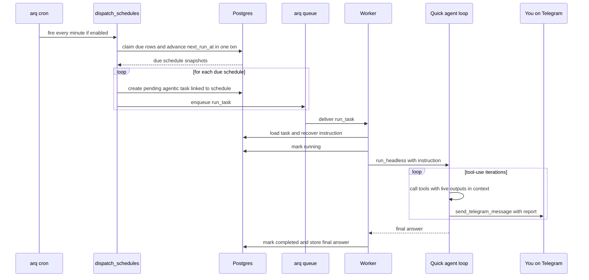
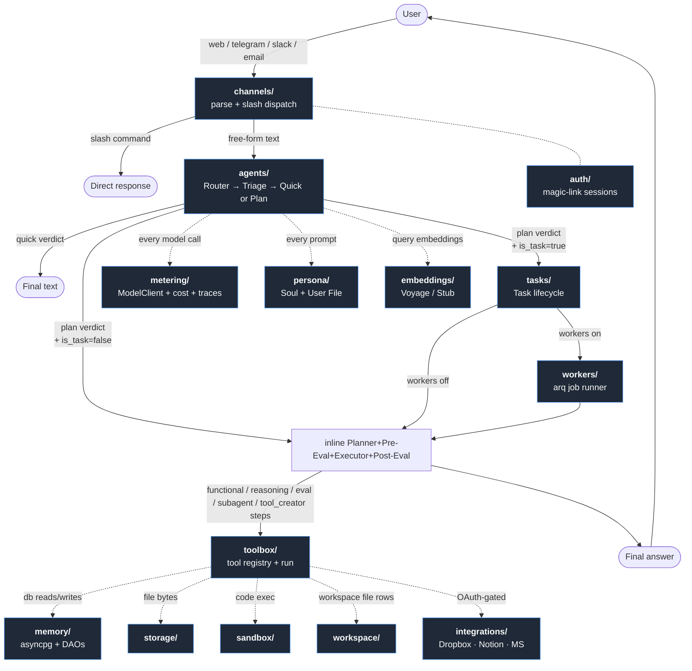

# Wolfpaw
## Tread lightly.

*Wolfpaw is the trustworthy long-running agent for the channels you already use — at a cost you can see, with capabilities you explicitly grant.*

---

## What is Wolfpaw?

A careful, capable, general-purpose AI worker for people who want an intelligent employee in the channels they already use — web, Telegram, Slack, email — without the setup tax of running their own agent.

Wolfpaw is an agentic *worker*, not just an assistant. It runs code in a sandbox, takes on multi-day tasks, produces real deliverables (spreadsheets, PDFs, slide decks, charts), and works in the background while you're doing other things. You decide what it can see and how you want to talk to it. You control your data; Wolfpaw earns its keep through quiet, careful, useful work.

Its motto, *Tread lightly,* is also its design constraint: take the smallest action that meets the goal, ask before doing anything destructive, surface uncertainty plainly, and never surprise the user with a hidden bill. Wolfpaw learns the person it works for over time — their tasks, their preferences (the User File), their past plans (procedural memory), the skills it distills from successful runs — but it stays general, not specialist.

---

## How Wolfpaw differs from its neighbors

| System | Optimized for | Wolfpaw's contrast |
|---|---|---|
| **OpenClaw** | Open-source, local-first, full system access on a power user's own hardware. Hackable kernel, mature ecosystem. | Wolfpaw is channel-native (web / Telegram / Slack / email) rather than desktop-native, and intentionally conservative on local capability. Audience is people who *don't* want an agent with root on their laptop. |
| **NanoClaw** | A minimal agent kernel — small, focused, a building block you wire up yourself. | Wolfpaw is a full product, not a kernel: channels, tasks, billing, memory, sandbox, observability all in one. Wolfpaw borrows NanoClaw's credential-vault pattern but ships the whole stack around it. |
| **Claude Desktop** | A first-party chat client for Claude on macOS / Windows, with MCP tool integration and local file access. Conversational, in-the-moment. | Wolfpaw runs *across* sessions, not inside one. It owns long-running tasks that pause when blocked and resume across days, pings you on whichever channel suits the moment, and produces real deliverables — not just a chat reply. |
| **Claude Cowork** | Anthropic's hosted agentic system for knowledge workers — bundled inference, desktop companion, deep first-party integrations (Drive, Gmail, Slack, DocuSign, FactSet). | Wolfpaw differentiates on channel mix (Telegram + email forwarding, not desktop), explicit cost mechanics (hard pause at cap, `/usage`), read-only-by-default scopes, model portability, and self-host as a first-class deployment path. |

The through-line: **OpenClaw maximizes capability on your own machine. NanoClaw is the minimum viable kernel. Claude Desktop is a chat client. Cowork is the model vendor's first-party agent. Wolfpaw is the careful, channel-native worker that gets real work done at a cost you can see — self-hostable and operator-deployable.**

A longer feature-by-feature comparison lives in [`spec.md`](spec.md).

---

## Documentation map

| File | What it covers |
|---|---|
| [`README.md`](README.md) | This file — pitch, neighbor comparison, top-level architecture, build status |
| [`spec.md`](spec.md) | v1 product spec; long feature-by-feature comparison with OpenClaw and Cowork; scope decisions |
| [`v2_spec.md`](v2_spec.md) / [`v3_spec.md`](v3_spec.md) | Subsequent design rounds (self-improving agent, integrations, reliability) |
| [`implementation_plan.md`](implementation_plan.md) | v1 schema, infra, tools, sandbox, tasks, metering, build order with ✅ markers |
| [`v2_implementation_plan.md`](v2_implementation_plan.md) | v2+ build order — same shape, ✅ markers |
| [`soul.md`](soul.md) | Agent persona — loaded into every agent prompt |
| [`WolfPaw_01.pdf`](WolfPaw_01.pdf) | Canonical architecture drawing |
| [`docs/uml_class_diagram.md`](docs/uml_class_diagram.md) | Detailed class structure across five Mermaid views |
| [`docs/self-host.md`](docs/self-host.md) | Self-host operator guide (env, compose, migrate, redeploy) |
| [`docs/oauth-integrations.md`](docs/oauth-integrations.md) | Dropbox / Notion / Microsoft provider setup |
| [`docs/decisions/`](docs/decisions/) | Architecture decision records (framework choice, observability) |
| `src/wolfpaw/<subpackage>/README.md` | Per-domain orientation with a focused flowchart — one in each subpackage. Start here when extending that domain. |

---

## Deploying Wolfpaw

This repo is the Wolfpaw app — agents, channels, memory, tools, sandbox, metering, REST + SSE API, React web client, arq worker, OAuth integrations. Deployable to your own server, laptop, or homelab. Bring your own model + embedding + (optional) sandbox API keys. Operate your own Telegram / Slack bots. You own everything. Released under the [MIT License](LICENSE).

Wolfpaw ships everything it needs to run on a single host or be wrapped behind a multi-tenant service. The deployment story — reverse proxy, log shipper, secrets management, infra-as-code — is intentionally left to the operator so this repo stays vendor-neutral.

---

## Usage

Wolfpaw is channel-native: you reach it where you already work.

### Channels

- **Web chat** — sign in at your deployment's URL, type in the chat box. Replies stream live. The React app under [`web/`](web/) ships chat + task list + workspace files + usage dashboard + monitoring dashboard + profile editor + Telegram / Slack link minting.
- **Telegram** — DM your bot after linking your account from web (deep-link onboarding: tap the link generated from `/me/profile`). Operators provision the bot via @BotFather and set `WOLFPAW_TELEGRAM_BOT_TOKEN` + `WOLFPAW_TELEGRAM_WEBHOOK_SECRET`.
- **Slack** — workspace install via OAuth (create your app from [`docs/slack-app-manifest.yaml`](docs/slack-app-manifest.yaml), then "Connect Slack" from the web app's profile page). `/wolfpaw <text>` slash command and DMs to the bot both go through the agent pipeline.
- **Email** *(roadmap)* — forward to a per-user alias on your deployment's domain; Wolfpaw reads, plans, and drafts a reply back to your verified inbox. Never sends on your behalf.

### Slash commands

Intercepted before the model in every channel so they don't burn tokens.

| Command | Behavior |
|---|---|
| `/help` | List available commands |
| `/usage`, `/usage today`, `/usage month`, `/usage all` | Token + sandbox-compute spend. `month` adds a by-agent breakdown. |
| `/tasks`, `/task <id>`, `/cancel <id>` | Task list + control |
| `/reset` | Start a new conversation thread |

### Workspace

Upload files for Wolfpaw to work with; pick up deliverables it produces. Same workspace whether you arrived via web, Telegram, or Slack — backed by the configured `Storage` provider (`LocalStorage` for dev / self-host; `S3Storage` for managed deployments). Workspace docs are also semantically indexed: the agent can find them by content via `search_docs(...)`, not just by filename. v1 is a flat namespace; folders and Drive / Dropbox sync are roadmap.

### Integrations

OAuth connectors that the agent can read/write through, gated by per-user consent: **Dropbox** (app-folder scoped), **Notion** (workspace pages), **Microsoft / Outlook Calendar**. Each lives in [`src/wolfpaw/integrations/`](src/wolfpaw/integrations/) and registers its own tools so they appear automatically in the Planner's catalog when the user has connected the provider.

### Tasks

Anything beyond a single chat turn becomes a **Task** — a persistent unit of work that can run for hours or days, pause when blocked, and ping you on your preferred channel when it needs input or has results ready. You see status, spend, and artifacts in the web app; cancel at any time. With `WOLFPAW_WORKERS_ENABLED=true`, tasks run on the arq worker so they survive process restarts.

### Self-healing

When a step fails with a recoverable tool error (e.g. "column doesn't exist — actual columns: [...]"), the Executor calls a cheap model to repair the inputs and retries once. If that still fails, the Planner is invoked again with the failure context and emits a *continuation plan* that finishes the original request. Capped per execution so it can't loop. See [`src/wolfpaw/agents/README.md`](src/wolfpaw/agents/README.md) for the recovery + replan flow.

### Cost control

Every model call and every sandbox-second is metered. The OSS app ships with a no-op `Enforcer` (every user runs as `tier="dev"`, metering on but no gating) — the `subscriptions` + `tier_limits` + `cost_notifications` schema is in place so operators can wire in a real enforcer + billing provider without migrations. `/usage` is the always-on receipt regardless of whether enforcement is wired.

### Observability

Every model call also writes a trace row: system prompt, messages in, response, latency, token counts, and — critically — the exception when the call *failed*. `token_usage` only ever sees successful calls, so the trace log is the only record that a failed attempt happened at all. The **Monitoring** tab (`/monitor`) reads it back as error rate, p50/p95 latency and per-agent breakdowns, a list of traces (one per inbound prompt), and a drill-down into every call inside one. Payloads are partitioned monthly and expire on their own short clock (`WOLFPAW_TRACE_RETENTION_DAYS`, default 14) while the cost rows keep a much longer history. Nothing leaves your deployment — there is no third-party tracing vendor in the path. See [`metering/README.md`](src/wolfpaw/metering/README.md).

### Running Wolfpaw

Two paths:

**Self-host via Docker Compose** (recommended for actually using the app):

```bash
./install.sh
```

That generates a session key, asks you to fill in `WOLFPAW_ANTHROPIC_API_KEY` in `.env`, and on re-run brings up Postgres + Redis + the backend + the worker + the React app behind nginx. Visit http://localhost:3000. Full reference in [`docs/self-host.md`](docs/self-host.md). After a redeploy run `git pull && docker compose up -d --build && docker compose restart web` so nginx picks up the fresh upstream.

**Direct (no Docker, for contributing)** — two processes, backend on :8000, React app on :5173:

```bash
# terminal 1 — backend
uv sync --extra dev
.venv/bin/uvicorn wolfpaw.api:app --reload

# terminal 2 — frontend
cd web && npm install && npm run dev
```

Visit http://localhost:5173 → sign-in page. Enter your email; the backend's console email backend prints the verify URL to its stdout. Copy the token from the printed URL and visit `http://localhost:5173/signin/verify?token=<token>` — that sets the `wp_session` cookie and bounces you into `/chat`.

Prefer curl? Same magic link, then:

```bash
curl -N -X POST localhost:8000/channels/web/chat \
  -H 'content-type: application/json' \
  -b 'wp_session=<value from /auth/verify>' \
  -d '{"content": "/usage"}'
```

---

## Scheduled Tasks

Wolfpaw can run work later — once ("remind me in 20 minutes"), on an interval, or on a cron schedule ("every morning at 8"). When you ask, the agent calls the `schedule_task` tool, which splits your request into a *cadence* (the recurrence) and a self-contained *instruction* (what to do on one run, with any "otherwise stay silent" condition baked in), and writes a single row to the `schedules` table. That row is a template: it stores the what (instruction + resolved context + cross-run state) and the when (`next_run_at` plus the recurrence kind), scoped to your user so nothing else can read or cancel it. You can see everything pending in the **Scheduled** tab and cancel from chat.

Dispatch is a per-minute arq cron on the worker (`dispatch_schedules`). Each firing claims every `schedules` row that's due (`status='active' AND next_run_at <= now`) using `FOR UPDATE SKIP LOCKED`, and **in the same transaction** advances each claimed row to its next slot — recomputing `next_run_at`, or marking it `done` for a one-shot or an exhausted recurrence. Advancing before spawning gives at-most-once semantics and makes the dispatcher safe to run concurrently and across overlapping minutes. For every claimed schedule the dispatcher renders the instruction into a headless prompt ("you're a scheduled job — don't ask questions, reach out via `send_telegram_message` if the instruction says to"), creates a `pending` task linked back to the schedule, and enqueues a `run_task` job. The whole cron is gated behind `WOLFPAW_SCHEDULES_ENABLED=true` (and requires `WOLFPAW_WORKERS_ENABLED=true`), so it's safe to keep registered everywhere and opt into the recurring token spend per deployment.

The worker picks up the `run_task` job, recovers the instruction from the task's `status.pending` event, and runs it through the **Quick agent's tool loop** — the same engine that handles a one-shot message you type in chat — rather than the static planner→executor pipeline. This matters: the loop calls tools iteratively with their real outputs in context, so a "fetch the weather, then send it to me" instruction actually fetches *and* sends, whereas the static pipeline can't thread a freshly-composed value into a later tool call. On success the task settles to `completed` (with the loop's final answer stamped on the event for visibility in the Scheduled/Tasks views); on error it settles to `failed`. Delivery to you happens inside the loop via `send_telegram_message`, not via the task completion itself — consistent with the "scheduled runs are silent unless they reach out" contract.



---

## Architecture — top level

The reference architecture diagram is [`WolfPaw_01.pdf`](WolfPaw_01.pdf). Below is the **top-level query flow**: what happens at the boundary of each subsystem. As soon as control crosses into a folder under `src/wolfpaw/`, follow the link to that folder's README for the internal flowchart.



Read top-to-bottom:

1. **[`channels/`](src/wolfpaw/channels/README.md)** receives whatever the user sent (web SSE chat, Telegram webhook, Slack events) and normalizes it into an `InboundMessage`. Slash commands are intercepted here and never reach the model; everything else hands off to the Router. [`auth/`](src/wolfpaw/auth/README.md) resolves the user behind the request.
2. **[`agents/`](src/wolfpaw/agents/README.md)** owns the Router → Triage → (Quick | Plan) pipeline. Plan path runs Pre-Evaluator → Executor → Post-Evaluator and may emit a new Skill at the end. Self-healing lives here too: when a step fails, the Executor first tries to repair the inputs via a cheap model call, then asks the Planner for a continuation plan if that doesn't unblock.
3. **[`tasks/`](src/wolfpaw/tasks/README.md)** wraps the plan pipeline in a persistent Task row when the Planner decides the work needs a long-running lifecycle (deliverables, monitoring, `ask_user` pauses). With workers enabled, [`workers/`](src/wolfpaw/workers/README.md) runs the task off the request thread.
4. **[`toolbox/`](src/wolfpaw/toolbox/README.md)** is where every functional step ends up. Tools speak to [`memory/`](src/wolfpaw/memory/README.md) (Postgres + pgvector), [`storage/`](src/wolfpaw/storage/README.md) (file bytes), [`sandbox/`](src/wolfpaw/sandbox/README.md) (Python execution), [`workspace/`](src/wolfpaw/workspace/README.md) (catalog rows + embeddings), and [`integrations/`](src/wolfpaw/integrations/README.md) (OAuth-gated external services).
5. **Cross-cutting:** every model call funnels through [`metering/`](src/wolfpaw/metering/README.md) (pricing, recording, trace log). Every system prompt is assembled by [`persona/`](src/wolfpaw/persona/README.md) (Soul + User File). Query / document embeddings come from [`embeddings/`](src/wolfpaw/embeddings/README.md).

Detailed class-level views (5 axes, ~200 lines of Mermaid) live in [`docs/uml_class_diagram.md`](docs/uml_class_diagram.md). The full architectural drawing is [`WolfPaw_01.pdf`](WolfPaw_01.pdf).

---

## Repo layout

```
wolfpaw/
  pyproject.toml
  README.md                          # this file
  spec.md / v2_spec.md / v3_spec.md  # product specs (build phases)
  implementation_plan.md             # v1 build order (✅ markers)
  v2_implementation_plan.md          # v2/v3 build order (✅ markers)
  soul.md                            # agent persona — loaded into every prompt
  WolfPaw_01.pdf                     # architecture diagram (canonical)
  Dockerfile                         # backend image
  docker-compose.yml                 # db + redis + migrate + app + worker + web
  install.sh                         # one-shot self-host setup
  .env.example                       # env template
  docs/
    self-host.md                     # self-host reference
    oauth-integrations.md            # Dropbox/Notion/Microsoft provider setup
    slack-app-manifest.yaml          # Slack app manifest
    uml_class_diagram.md             # detailed Mermaid class views (5 axes)
    decisions/                       # ADRs
  scripts/
    migrate.py                       # idempotent schema migration runner
  migrations/
    001_init.sql                     # users, threads, plans, tasks, sandboxes, token_usage, …
    002_auth.sql                     # magic_link_tokens
    003_sandbox.sql                  # sandbox + compute_usage
    004_seed_skills.sql              # seeded starter skills marker
    005_post_evaluator.sql           # nullable task_id on task_events
    006_telegram.sql                 # channel_links + channel_link_tokens
    007_slack.sql                    # slack_workspaces
    008_conv_compaction.sql          # thread_summaries fold tracking
    009_skill_distiller.sql          # auto-emitted skills metadata
    010_skill_supersession.sql       # superseded_by + Sleep Cycle consolidation
    011_tool_creator.sql             # tools table + ToolCreator approvals
    012_integrations.sql             # dropbox_links + oauth_states
    013_notion.sql                   # notion_links
    014_microsoft.sql                # microsoft_links
    015_workspace_embeddings.sql     # vector(1024) + ivfflat on workspace_files
    016_schedules.sql                # scheduled/recurring task rows
    017_l3_digest.sql                # L3 summary level (single rewritten-in-place digest)
    018_message_embeddings_hnsw.sql  # swap message_embeddings ivfflat → hnsw
    019_pending_questions.sql        # durable human-in-the-loop (ask_user)
    020_pending_question_expiry.sql  # expiry on pending questions
    021_model_call_logs.sql          # per-attempt model-call trace log,
                                     #   monthly partitions
  src/wolfpaw/
    api.py                           # FastAPI app — mounts every router below
    config.py                        # env, model IDs, feature flags, backend selection
    schemas.py                       # cross-package dataclasses (Plan, Step, ReplanContext, …)
    tracing.py                       # trace_id contextvar + structured JSON logger
    agents/                          # Router, Triage, Quick, Planner, Pre/Post-Eval,
                                     #   Executor (with retry + replan), Skill Distiller,
                                     #   Tool Creator   [README]
    auth/                            # magic-link auth, sessions, user bootstrap  [README]
    channels/                        # Channel ABC, web SSE, Telegram, Slack,
                                     #   slash dispatcher  [README]
    embeddings/                      # EmbeddingClient ABC, Voyage + Stub providers  [README]
    integrations/                    # Dropbox, Notion, Microsoft Calendar
                                     #   (OAuth state + per-provider clients + tools)  [README]
    memory/                          # asyncpg pool, conversational + tiered summaries,
                                     #   procedural, skills, task_events, channel_links,
                                     #   slack_workspaces  [README]
    metering/                        # cost recording, prompt versions, ModelClient,
                                     #   model-call trace log, /usage, /monitor  [README]
    persona/                         # Soul loader, UserProfile DAO, system-prompt
                                     #   builder, /me/profile  [README]
    sandbox/                         # Sandbox ABC, Subprocess/Docker/E2B,
                                     #   SandboxManager, compute metering  [README]
    storage/                         # Storage ABC, LocalStorage, S3Storage,
                                     #   HMAC signing  [README]
    tasks/                           # Task lifecycle service, ask_user registry,
                                     #   slash commands, REST routes  [README]
    toolbox/                         # tool registry + 20+ tools (info, docs, SQL CRUD,
                                     #   sandbox, artifacts, ask_user, doc search,
                                     #   integrations)  [README]
    workers/                         # arq job runner: compact_thread, embed_message,
                                     #   embed_workspace_file, run_task, channel
                                     #   dispatch, sleep_cycle  [README]
    workspace/                       # workspace_files DAO (with embedding) + REST API  [README]
  tests/
    test_*.py                        # ~460 unit + ~160 DB-gated as of v2 phase C
web/                                 # React + Vite SPA + nginx Dockerfile  [README]
```

Each subfolder has its own README — start there when extending that domain. The grouping matches the architecture views: every diagram block has a home, and the cross-cutting concerns (metering, tracing) are sibling packages rather than mixed into the agents.

---

## Build status

The v1 build order ran 21 steps and is shipped end-to-end. v2 extends with self-improving agent behavior, OAuth integrations, and reliability features. Detailed step-by-step receipts are in [`implementation_plan.md`](implementation_plan.md) (v1) and [`v2_implementation_plan.md`](v2_implementation_plan.md) (v2+).

**Shipped:**

- **v1 foundation** — FastAPI, magic-link auth, ModelClient with metering, slash dispatcher, `/usage`, Storage abstraction (Local + S3), workspace file API, sandbox (Subprocess + Docker + E2B), artifact tools (PDF / xlsx / slides / chart), Quick Agent, Triage, Planner, Executor, Post-Evaluator, Task lifecycle + `ask_user`, subagent steps, Soul + User File, Telegram, web SPA, Docker Compose self-host, Slack.
- **v2 self-improving agent (phase A + B)** — tiered conversational memory (L1/L2 compaction + per-thread vector recall), arq worker, Plan Pre-Evaluator with one-retry loop, Skill auto-emission on high-scoring reusable plans, weekly Sleep Cycle (skill consolidation), structured subagent failure policies (`fail` / `drop` / `retry`), Tool Creator agent with `ask_user` approval.
- **v2 integrations (phase C, partial)** — Dropbox app-folder, Notion workspace, Microsoft Outlook Calendar. Google Calendar (#31) and Gmail readonly (#33) are deferred pending Google verification.
- **v3 reliability + memory** — full row-level CRUD on user SQL tables, schema introspection (`list_tables`, `describe_table`) with column-hint errors on failure, document semantic search (`list_docs`, `search_docs` over embedded `workspace_files`), self-healing recovery on `ToolError` (step-level input repair + one mid-plan replan with the Planner).
- **v4 unified long-running memory** — one channel-agnostic conversation per user (web / Telegram / Slack share a single thread, with per-message channel provenance), a size-capped **L3 digest** that folds L2s into a single rewritten-in-place summary so the prompt stays flat no matter how long the conversation runs, **recency-weighted vector recall** that returns each hit wrapped in neighbor messages for coherence, an **HNSW** index on `message_embeddings` for recall that stays fast as the thread grows, plus **`recall_memory`** — a deliberate, age-blind, all-threads deep-recall tool ("remember when we talked about X"). All knobs are env-tunable — see [`memory/README.md`](src/wolfpaw/memory/README.md#tuning-conversational-memory).
- **v5 observability** — per-attempt model-call trace log (`model_call_logs`) capturing prompts, responses, latency and failures, with `run_id` / `parent_run_id` preserving sub-agent nesting; a `/monitor` API and **Monitoring** tab over it (health tiles, failure breakdown by type + agent, trace drill-down); monthly partitioning with a daily retention job so payloads expire without a bulk `DELETE`. Replaced the LangSmith dependency — traces stay in your own Postgres.

**Roadmap (not yet built):** confirm-gated "delete memories about X" / forgetting tool (deletion + summary-scrub deferred), proactive task-completion push to the user's preferred channel (#37), Slack `app_mention` + threads (#35), Telegram inline keyboards (#36), email forwarding intake, full-fat usage dashboard, OpenTelemetry tracing (cross-process; in-process call nesting already lands via `run_id` / `parent_run_id`), entity / knowledge-base memory.

**Tests:** `pytest` runs ~460 unit tests in under a minute; another ~160 DB-gated tests skip without a `WOLFPAW_TEST_DATABASE_URL`. CI deploys via `git pull && docker compose up -d --build && docker compose restart web` (the `restart web` ensures nginx flushes its upstream DNS).

---

## License

Wolfpaw is released under the [MIT License](LICENSE). You may use, modify, distribute, and self-host it freely, including in commercial settings, as long as the copyright notice and license text travel with substantial portions of the code.
