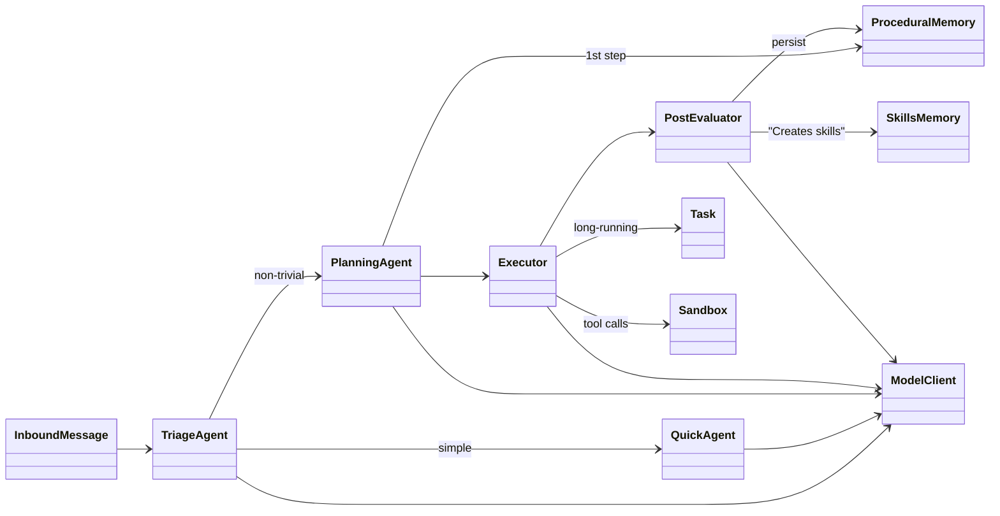
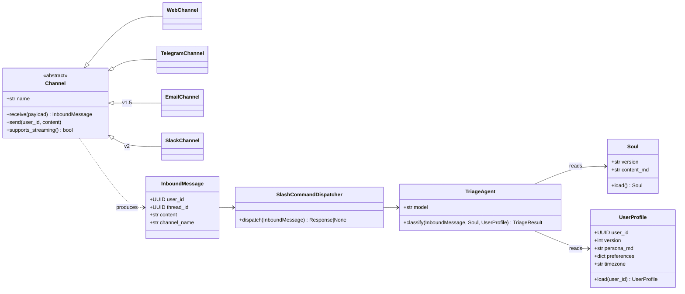
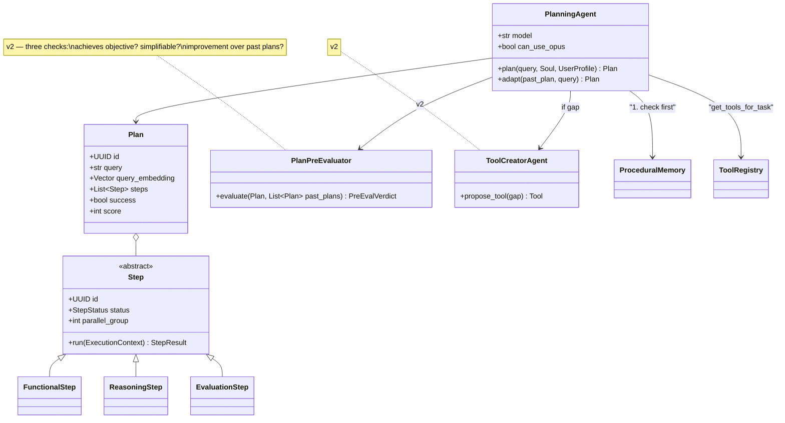
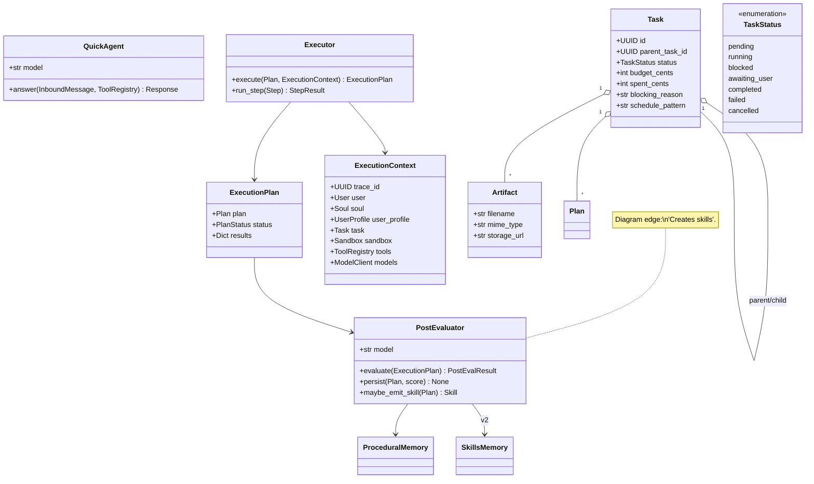
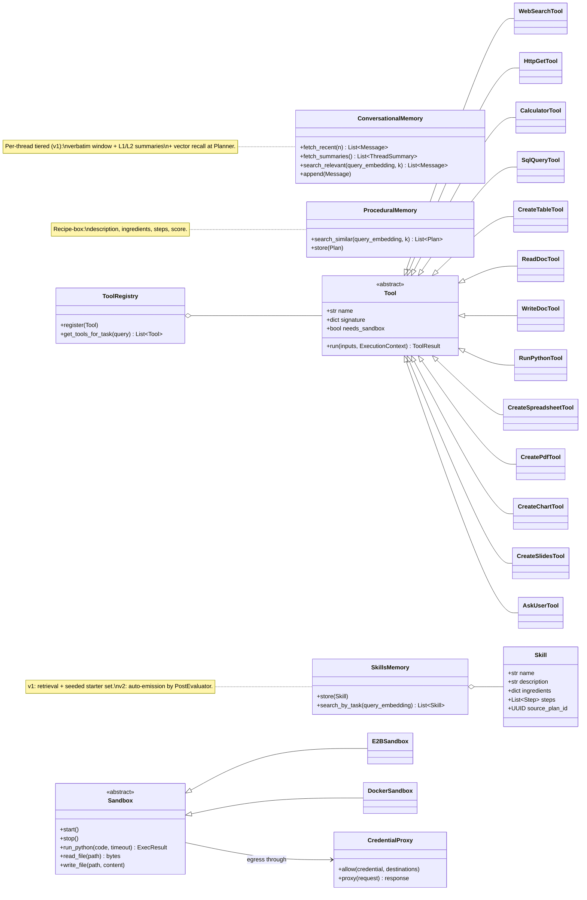
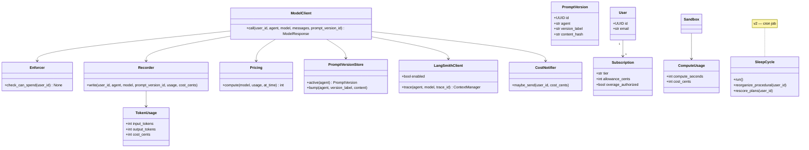

# Wolfpaw

### *Tread lightly.*

A careful, capable, general-purpose AI worker for people who want an intelligent employee in the channels they already use — web, Telegram, email — without the setup tax of running their own agent.

---

## What is Wolfpaw?

Wolfpaw is an agentic *worker*, not just an assistant. It runs code in a sandbox, takes on multi-day tasks, produces real deliverables (spreadsheets, PDFs, slide decks, charts), and works in the background while you're doing other things. You decide what it can see and how you want to talk to it. You control your data; Wolfpaw earns its keep through quiet, careful, useful work.

Its motto, *Tread lightly,* is also its design constraint: take the smallest action that meets the goal, ask before doing anything destructive, surface uncertainty plainly, and never surprise the user with a hidden bill. Wolfpaw learns the person it works for over time — their tasks, their preferences (the User File), their past plans (procedural memory) — but it stays general, not specialist.

**One sentence:** *Wolfpaw is the trustworthy long-running agent for the channels you already use — at a cost you can see, with capabilities you explicitly grant.*

## Two ways to use Wolfpaw

- **Wolfpaw Cloud (paid, hosted).** Sign up at wolfpaw.ai, pick a plan, talk to your agent in minutes. No API keys, no installation, no developer setup. Inference is included up to your tier's allowance. Pay-as-you-go is opt-in, never automatic.
- **Wolfpaw Open Source (self-hosted, free).** Same code, deployable to your own server, laptop, or homelab. Bring your own API keys. Operate your own Telegram bot. You own everything. License TBD.

One codebase, two distributions. The hosted product exists so non-developers can use Wolfpaw without setup; the OSS version exists so developers can hack on it, run it privately, and verify what it does with their data.

---

## How Wolfpaw differs from its neighbors

| System | Optimized for | Wolfpaw's contrast |
|---|---|---|
| **OpenClaw** | Open-source, local-first, full system access on a power user's own hardware. Hackable kernel, mature ecosystem. | Wolfpaw is hosted-first and intentionally conservative on local capability. Audience is people who *don't* want an agent with root on their laptop. Same OSS option for those who do. |
| **NanoClaw** | A minimal agent kernel — small, focused, a building block you wire up yourself. | Wolfpaw is a full product, not a kernel: channels, tasks, billing, memory, sandbox, observability all in one. Wolfpaw borrows NanoClaw's credential-vault pattern but ships the whole stack around it. |
| **Claude Desktop** | A first-party chat client for Claude on macOS / Windows, with MCP tool integration and local file access. Conversational, in-the-moment. | Wolfpaw runs *across* sessions, not inside one. It owns long-running tasks that pause when blocked and resume across days, pings you on whichever channel suits the moment, and produces real deliverables — not just a chat reply. |
| **Claude Cowork** | Anthropic's hosted agentic system for knowledge workers — bundled inference, desktop companion, deep first-party integrations (Drive, Gmail, Slack, DocuSign, FactSet). | Wolfpaw differentiates on channel mix (Telegram + email forwarding, not desktop), explicit cost mechanics (hard pause at cap, opt-in overage, `/usage`), read-only-by-default scopes, model portability (v2), and the OSS / self-host distribution. |

The through-line: **OpenClaw maximizes capability on your own machine. NanoClaw is the minimum viable kernel. Claude Desktop is a chat client. Cowork is the model vendor's first-party hosted agent. Wolfpaw is the careful, channel-native worker that gets real work done at a cost you can see.**

A longer feature-by-feature comparison lives in [`spec.md`](spec.md).

---

## Architecture

The full system flow is captured in the architecture diagram:

[**WolfPaw architecture diagram (PDF)**](WolfPaw_00.pdf)

<object data="WolfPaw_00.pdf" type="application/pdf" width="100%" height="700px">
  <a href="WolfPaw_00.pdf">View WolfPaw_00.pdf</a>
</object>

A user message — typed in the web app, sent to the Telegram bot, or forwarded by email — flows through a structured loop:

1. **Triage.** A small fast model (Haiku) figures out what the user actually wants and how big a job it is. Conditioned on the Soul File (agent persona) and the User File (the user's persona and preferences).
2. **Plan** (when the job is non-trivial). A larger model (Sonnet, sometimes Opus) checks procedural memory first — *have we solved something like this before?* — then assembles a plan. If the work is multi-step or produces deliverables, Wolfpaw creates a **Task**: a persistent unit of work that can run for hours or days, pause when blocked, and resume later.
3. **Execute.** Each step runs as a functional step (pure tool call), a reasoning step (model), or an evaluation step. Big plans branch into parallel sub-agents with their own budgets, then synthesize their outputs. Code runs in a sandboxed Python environment.
4. **Evaluate.** The Post-Evaluator scores the outcome, persists the plan into procedural memory (a recipe-box of description + ingredients + steps), and — when the result is reusable — emits a generalized **Skill** the planner can pull next time.

### Runtime wiring (top-level)



Five detailed class views below; full UML doc with the box-to-class crosswalk lives in [`docs/uml_class_diagram.md`](docs/uml_class_diagram.md).

<details>
<summary><strong>View 1 — Channels, Persona, Triage</strong></summary>



</details>

<details>
<summary><strong>View 2 — Planning Loop</strong></summary>



</details>

<details>
<summary><strong>View 3 — Execution, Tasks, Sub-agents</strong></summary>



</details>

<details>
<summary><strong>View 4 — Memory, Tools, Sandbox</strong></summary>



</details>

<details>
<summary><strong>View 5 — Model client, metering, observability, identity</strong></summary>



</details>

---

## Proposed repo layout

```
wolfpaw/
  pyproject.toml
  README.md                          # this file
  LICENSE                            # TBD
  spec.md                            # product spec + neighbor comparison
  implementation_plan.md             # schema, infra, build order
  soul.md                            # agent persona
  WolfPaw_00.pdf                     # architecture diagram (canonical)
  docs/
    uml_class_diagram.md             # anticipated class structure (Mermaid)
    decisions/                       # architecture decision records
      framework-choice.md
      observability.md
  migrations/
    001_init.sql                     # users, threads, plans, tasks, sandboxes, token_usage, …
    002_channels.sql                 # channel_links, email_aliases, verified_owner_emails
    003_billing.sql                  # subscriptions, tier_limits, cost_notifications
  src/wolfpaw/
    config.py                        # env, model IDs, feature flags
    api.py                           # FastAPI app
    deps.py                          # FastAPI dependency wiring
    tracing.py                       # trace_id, structured JSON logger
    schemas.py                       # Plan, Step, TriageResult, ExecutionContext, …
    soul.py                          # loads soul.md
    user_profile.py                  # loads/saves per-user User File
    auth/
      magic_link.py                  # passwordless email auth
      oauth_google.py                # Google OAuth
      api_keys.py                    # per-user API keys
      middleware.py                  # request → user resolution
    agents/
      triage.py
      quick.py
      planner.py
      executor.py
      post_evaluator.py
      pre_evaluator.py               # v2
      tool_creator.py                # v2
    memory/
      db.py                          # asyncpg pool
      conversational.py
      procedural.py                  # recipe-box
      skills.py                      # v2
    toolbox/
      registry.py
      tools/
        web_search.py                # Tavily
        http_get.py
        calculator.py
        sql_query.py
        create_table.py
        read_doc.py
        write_doc.py
        run_python.py                # sandbox
        install_package.py           # sandbox
        create_spreadsheet.py        # sandbox: openpyxl
        create_pdf.py                # sandbox: weasyprint
        create_chart.py              # sandbox: matplotlib
        create_slides.py             # sandbox: python-pptx
    sandbox/
      base.py                        # Sandbox ABC
      e2b.py                         # hosted
      docker.py                      # self-host
      proxy.py                       # credential vault proxy
    storage/
      base.py                        # Storage ABC
      s3.py
      local.py
      drive.py                       # v2
      dropbox.py                     # v2
    channels/
      base.py                        # Channel ABC
      commands.py                    # slash-command dispatcher
      web.py                         # /chat SSE endpoint
      telegram.py                    # webhook + bot client
      email.py                       # v1.5
      slack.py                       # v2
    tasks/
      lifecycle.py                   # status transitions
      events.py                      # task_events writer
      artifacts.py
    billing/
      stripe_client.py
      webhook.py
      tiers.py
      cost_notifications.py
    metering/
      pricing.py
      recorder.py
      enforcer.py
      summarizer.py
      prompt_versions.py
      langsmith_client.py
      usage_report.py                # backs /usage
    workers/
      arq_app.py                     # arq worker entrypoint
      jobs/                          # scheduled tasks, notifications, sleep cycle (v2)
  web/                               # React + Vite frontend
    src/
    public/
    package.json
    vite.config.ts
  infra/
    terraform/                       # EC2, RDS, ElastiCache, SES, Caddy, IAM
    dashboards/
      wolfpaw.json                   # CloudWatch dashboard
      insights/                      # saved Logs Insights queries
    deploy/
      systemd/                       # unit files
      caddy/                         # Caddyfile
  tests/
    test_*.py
```

The grouping matches the architecture views: every diagram block has a home (`agents/`, `memory/`, `toolbox/`, `sandbox/`, `channels/`), and the cross-cutting concerns (metering, tracing, billing) are sibling packages rather than mixed into the agents.

---

## Status

Pre-launch. Spec and architecture locked in; implementation hasn't started in this directory yet. The v1 build order (numbered steps from foundation through Slack) is in [`implementation_plan.md`](implementation_plan.md). Highlights:

- Metering and observability go in **before** any model call — every token + every compute-second is recorded from the first agent step.
- The code-execution sandbox lands before any agent uses it (steps 8–9), so from the first model call onward every task already has the worker capabilities it needs.
- Conversational memory is tiered from v1 — verbatim recent window, level-1/level-2 rolling summaries, and per-thread vector recall at the Planner. Tiered compaction worker lands at step 12.5.
- Skills retrieval ships in v1 against a hand-written **seeded starter set**; auto-emission by the Post-Evaluator stays v2.
- Tasks (step 15) and sub-agent delegation (step 16) sit between the agent loop and the channels — once they exist, Wolfpaw can take on multi-day work. The `ask_user` HITL tool rides on the same `awaiting_user` machinery.

The repo currently lives inside [`dmitris-fabulous/wolfpaw/`](.) for incubation; it will move to its own standalone repo before public release.

---

## Documentation map

| File | What it covers |
|---|---|
| [`README.md`](README.md) | This file — pitch, comparison, architecture overview |
| [`spec.md`](spec.md) | Product spec; long feature-by-feature comparison with OpenClaw and Cowork; scope decisions |
| [`implementation_plan.md`](implementation_plan.md) | Locked-in decisions, Postgres schema, tools, sandbox, tasks, metering, build order |
| [`soul.md`](soul.md) | Agent persona — loaded into every agent prompt |
| [`WolfPaw_00.pdf`](WolfPaw_00.pdf) | Canonical architecture diagram |
| [`docs/uml_class_diagram.md`](docs/uml_class_diagram.md) | Anticipated class structure across five views, plus diagram-box-to-class crosswalk |
| [`docs/decisions/`](docs/decisions/) | Architecture decision records (framework choice, observability) |

---

## License

TBD. Will be open-source-friendly; specific license decided later.
