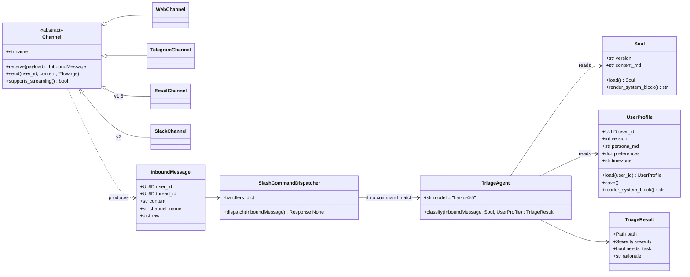
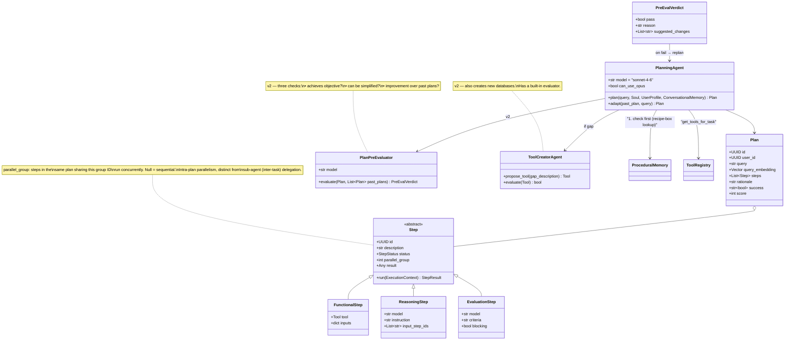
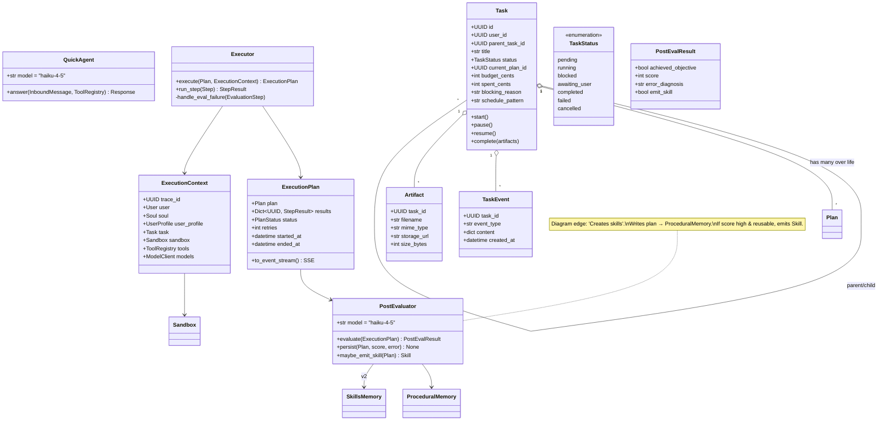
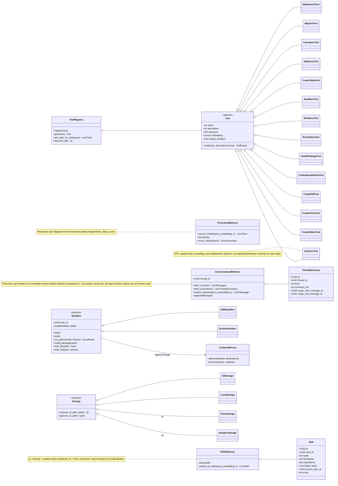
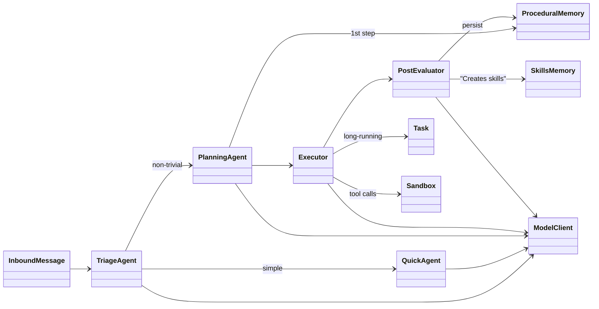

# Wolfpaw — UML Class Diagram (v1)

Anticipated classes for the agent. Maps every box in [`WolfPaw_00.pdf`](../WolfPaw_00.pdf) to a Python class (or abstract base + adapters), plus the supporting infrastructure called out in [`implementation_plan.md`](../implementation_plan.md). v2-only classes are marked `[v2]`.

The diagram is split into five views to stay readable. Open this file in a Markdown viewer that renders Mermaid (GitHub, VS Code with the Mermaid extension, Obsidian).

---

## View 1 — Channels, Persona, and Triage

The user-facing edge: a message comes in on a channel, hits the slash-command dispatcher, and (if not a built-in command) enters the agent pipeline conditioned on the Soul File and the User File.

---

## View 2 — Planning Loop

The Planner is its own agentic loop: pull from procedural memory first, get tools for each step, optionally call the Pre-Evaluator, optionally request a new tool, and emit a Plan. Each Step is one of three subtypes (functional / reasoning / evaluation), matching the diagram's labeling.

---

## View 3 — Execution, Tasks, and Sub-agents

The Executor runs the Plan as an `ExecutionPlan` (the diagram's renamed "Execution Plan"). Long-running work is promoted to a `Task` with status, budget, and sub-task delegation. The Post-Evaluator scores the plan, persists it to procedural memory, and — per the new "Creates skills" edge in the diagram — emits a generalized `Skill` when the result is reusable.

---

## View 4 — Memory, Tools, Sandbox

Three memory subsystems (conversational, procedural, skills), the tool registry with concrete tools, and the sandbox abstraction backing `run_python` and the artifact tools.

---

## View 5 — Model client, metering, observability, identity

Every model call funnels through a single `ModelClient` wrapper that enforces cap, records usage, writes a trace run to `model_call_logs`, and stamps the active prompt version on the row. Identity & billing classes are included for completeness — they live below the agent layer but every agent class transits through them.

```mermaid
classDiagram
    direction TB

    class ModelClient {
        +call(user_id, agent, model, messages, prompt_version_id) ModelResponse
        -anthropic: AnthropicClient
    }

    class Enforcer {
        +check_can_spend(user_id) None
        -fetch_period_usage(user_id) UsageSummary
    }
    class Recorder {
        +write(user_id, agent, model, prompt_version_id, usage, cost_cents, trace_id)
    }
    class Pricing {
        +compute(model, usage, at_time) int
        -model_prices: List~ModelPrice~
    }
    class PromptVersionStore {
        +active(agent) PromptVersion
        +bump(agent, version_label, content)
    }
    class PromptVersion {
        +UUID id
        +str agent
        +str version_label
        +str content_hash
        +dict content_template
    }
    class PostgresTraceSink {
        +bool enabled
        +trace(user_id, agent, model, messages, system, ...) ContextManager~ModelRun~
    }
    class ModelRun {
        +UUID run_id
        +UUID parent_run_id
        +str status
        +mark_response(raw, text)
        +mark_cost(usage, cost_cents, token_usage_id)
        +mark_error(exc)
    }
    class CostNotifier {
        +maybe_send(user_id, cost_cents)
    }

    ModelClient --> Enforcer : pre-check
    ModelClient --> PostgresTraceSink : wrap
    PostgresTraceSink ..> ModelRun : yields
    ModelClient --> Recorder : post-record
    ModelClient --> Pricing : compute cost
    ModelClient --> PromptVersionStore : resolve version
    ModelClient --> CostNotifier : threshold check
    PromptVersionStore o-- PromptVersion

    class User {
        +UUID id
        +str email
        +bool email_verified
        +str display_name
    }
    class AuthMethod {
        +str method
        +str identifier
    }
    class ApiKey {
        +str prefix
        +str hash
        +str name
    }
    class Subscription {
        +str stripe_subscription_id
        +str tier
        +int allowance_cents
        +bool overage_authorized
        +int overage_cap_cents
    }
    class TierLimits {
        +str tier
        +int allowance_cents
        +List~str~ channels_allowed
        +bool opus_allowed
        +bool scheduled_tasks_allowed
    }
    User "1" --> "*" AuthMethod
    User "1" --> "*" ApiKey
    User "1" --> "1" Subscription
    Subscription --> TierLimits

    class TokenUsage {
        +UUID user_id
        +UUID task_id
        +UUID trace_id
        +UUID prompt_version_id
        +str agent
        +str model
        +int input_tokens
        +int output_tokens
        +int cost_cents
    }
    class ComputeUsage {
        +UUID user_id
        +UUID task_id
        +UUID sandbox_id
        +int compute_seconds
        +int cost_cents
    }
    Recorder --> TokenUsage : writes
    Sandbox --> ComputeUsage : writes on teardown

    class SleepCycle {
        +run() None
        +reorganize_procedural(user_id)
        +rescore_plans(user_id)
        +consolidate_skills(user_id)
    }
    note for SleepCycle "v2 — cron job that\norganizes memories."
```

---

## How the views connect

The five views are facets of one runtime; the same `ExecutionContext` flows through them.

---

## Class-to-diagram-box crosswalk

Quick reference: every block in `WolfPaw_00.pdf` and its corresponding class(es).

| Diagram box | Class(es) | v1/v2 |
|---|---|---|
| User | `User` | v1 |
| User File *(new)* | `UserProfile` | v1 |
| Soul File | `Soul` | v1 |
| Triage Agent | `TriageAgent`, `TriageResult` | v1 |
| Quick Agent | `QuickAgent` | v1 |
| Planning Agent | `PlanningAgent`, `Plan`, `Step` (+ subtypes) | v1 |
| Plan Pre-Evaluator | `PlanPreEvaluator`, `PreEvalVerdict` | v2 |
| Agent Loop / Execution Plan *(renamed)* | `Executor`, `ExecutionPlan`, `ExecutionContext` | v1 |
| Tool Creator Agent | `ToolCreatorAgent` | v2 |
| Toolbox | `ToolRegistry`, `Tool` + subclasses (incl. `AskUserTool` for HITL) | v1 |
| Skills | `SkillsMemory`, `Skill` | v1 retrieval + seeded set; v2 auto-emission |
| Procedural memory *(recipe-box)* | `ProceduralMemory` | v1 |
| Conversational Memory | `ConversationalMemory`, `ThreadSummary` (tiered: verbatim / L1 / L2 + vector recall) | v1 |
| Plan Post-Evaluator / Error Handler | `PostEvaluator`, `PostEvalResult` | v1 |
| Sleep Cycle | `SleepCycle` | v2 |
| Response | rendered via `Channel.send()` | v1 |
| (implicit) Sandbox | `Sandbox`, `E2BSandbox`, `DockerSandbox`, `CredentialProxy` | v1 |
| (implicit) Model calls | `ModelClient`, `Enforcer`, `Recorder`, `Pricing`, `PromptVersionStore`, `PostgresTraceSink` | v1 |
| (implicit) Tasks | `Task`, `TaskStatus`, `TaskEvent`, `Artifact` | v1 |
