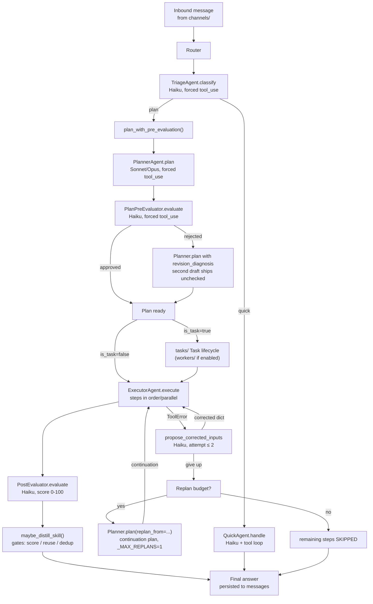
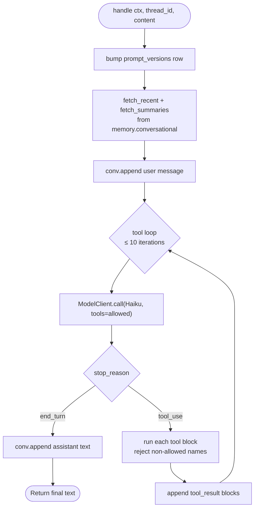
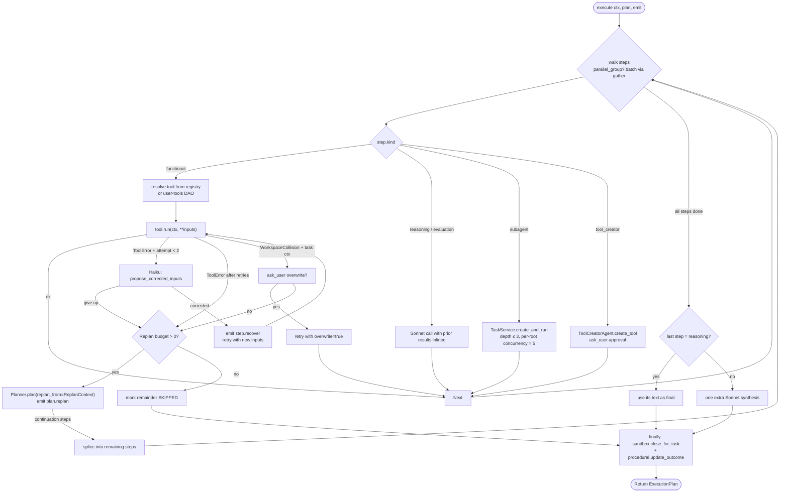

# agents/

The model-driven layer. Every channel ([`channels/`](../channels/README.md)) feeds free-form text into the **Router**, which composes the agents below into the pipeline that produces a final answer. Top-level orientation is in the [root README](../../../README.md).

## Files

- **`__init__.py`** — re-exports the agent classes + `get_*` / `reset_*` singletons.
- **`router.py`** — `Router`: the only thing channels call. Runs Triage, dispatches to Quick or Plan, emits SSE events the channels forward to the user.
- **`triage.py`** — `TriageAgent`: Haiku with a forced `classify` tool_use returning `TriageVerdict(route ∈ {quick, plan}, complexity, reasoning)`. Read-only — never writes to `messages`.
- **`quick.py`** — `QuickAgent`: Haiku + an allow-listed subset of the [`toolbox/`](../toolbox/README.md) registry (the non-sandbox tools). Iterative tool loop, capped at 10 iterations.
- **`planner.py`** — `PlannerAgent`: Sonnet (Opus for `ambitious`) with a forced `generate_plan` tool_use. Embeds the query via [`embeddings/`](../embeddings/README.md), retrieves similar past plans + relevant skills + the user's connected integrations + approved user-tools, then asks for a structured `Plan`. The Planner decides `plan.is_task` — the Task lifecycle is its call, not Triage's. Accepts an optional `replan_from: ReplanContext` for the Executor's self-healing path (see below).
- **`plan_pre_evaluator.py`** — `PlanPreEvaluatorAgent`: Haiku with a forced `evaluate_plan` tool_use returning three booleans (`achieves_objective`, `simplifiable`, `better_than_past_plans`) plus a `diagnosis`. Approves iff `achieves_objective AND NOT simplifiable AND better_than_past_plans`. `plan_with_pre_evaluation(...)` is the public helper — runs Planner → Pre-Eval → (one retry with `revision_diagnosis` on rejection) → ships.
- **`executor.py`** — `ExecutorAgent`: runs a `Plan`. Five step kinds (`functional`, `reasoning`, `evaluation`, `subagent`, `tool_creator`). Concurrent dispatch for steps sharing a `parallel_group`. Self-healing: on `ToolError` the executor asks a cheap model to repair the inputs and retries once; if a step still fails, it asks the Planner for a continuation plan (`_MAX_REPLANS = 1`).
- **`post_evaluator.py`** — `PostEvaluatorAgent`: Haiku with a forced `record_score` tool_use returning a 0-100 score + diagnosis. Best-effort — scoring never blocks the user response. Persisted via `procedural.update_outcome` + a `task_events` row.
- **`skill_distiller.py`** — `SkillDistillerAgent`: Sonnet with a forced `emit_skill` tool_use. `maybe_distill_skill(...)` is the gated entry point — five checks (score, reusability, persisted plan, dedup via cosine similarity, valid distillation) before persisting a new Skill into [`memory/skills.py`](../memory/README.md).
- **`tool_creator.py`** — `ToolCreatorAgent`: Sonnet that proposes a new user-tool from a capability gap the Planner spotted. Pipeline: propose → embed → dedup → persist as `proposed` → `ask_user` for approval → mark `approved`/`rejected`.

## Flow

SSE event sequence on the plan path: `triage` → `pre_eval` (one or two) → `plan` → `step.start` / `step.end` / `step.error` per step → optional `step.recover` (input repair) → optional `plan.replan` (continuation) → `score` → optional `skill_emitted` → `delta` (final answer) → `done`. Task path adds a `task` event before the steps. `ask_user` pauses surface their own event.

## Why is_task lives on the Planner, not Triage

The Planner has the full retrieved context — tool catalog, past plans, skills, user profile, connected integrations — to judge whether work needs a Task lifecycle. Triage (Haiku, every-turn) just decides "is the Planner needed?" Letting Sonnet make the routing call avoids the prior bug where Triage's narrow context routed normal "save this to a file" requests into a long-running task that then sat idle.

## QuickAgent inner loop

Allow-list as of v3 reliability work: `calculator`, `http_get`, `web_search`, `sql_query`, `sql_insert`, `sql_update`, `sql_delete`, `create_table`, `list_tables`, `describe_table`, `read_doc`, `write_doc`, `list_docs`, `search_docs`. Sandbox + artifact tools belong to the Executor. The loop rejects any `tool_use` for a name not in `ALLOWED_TOOL_NAMES` with an `is_error` tool_result rather than calling the tool.

## ExecutorAgent — step kinds + self-healing

Recovery + replan are bounded: `_MAX_TOOL_ATTEMPTS = 2` (initial + one repair) and `_MAX_REPLANS = 1` per execution. The repair model is Haiku with a forced `propose_inputs` tool_use; if it sets `give_up=true` the step fails for real. Replan calls Planner with `thread_id=None` so chat history isn't reloaded — the `ReplanContext` block already carries focused context (original query + completed steps + failure).

Success semantics: an execution is `success=True` when no step is left SKIPPED and the last step COMPLETED. A FAILED step buried mid-stream is OK if the replan continuation finished the work.

## How it fits with the rest of the system

- **[`metering/`](../metering/README.md)** — every model call goes through `ModelClient`. Agents never call `anthropic.messages.create` directly.
- **[`toolbox/`](../toolbox/README.md)** — Quick + Executor resolve tools via the global registry; tools validate their own inputs against `input_schema`.
- **[`memory/`](../memory/README.md)** — conversational (recent + summaries + vector recall), procedural (past plans), skills, task_events.
- **[`embeddings/`](../embeddings/README.md)** — Planner uses `get_embedder()` to embed queries; provider selectable via `WOLFPAW_EMBEDDING_BACKEND`.
- **[`persona/`](../persona/README.md)** — every system prompt is assembled via `build_for_agent(user_id, agent_role)` (Soul + User File + role).
- **[`sandbox/`](../sandbox/README.md)** — Executor calls `get_sandbox_manager().close_for_task(...)` in `finally`. Sandbox tools implicitly create the sandbox on first call.
- **[`tasks/`](../tasks/README.md)** — Router wraps the plan pipeline in a Task row when `plan.is_task=true`.
- **[`workers/`](../workers/README.md)** — when `WOLFPAW_WORKERS_ENABLED=true`, task runs are enqueued on arq so they survive process restart.

## Extending

- **New agent** — class in its own module, set `AGENT_KIND` to the appropriate `agent_kind` enum value from `001_init.sql`, define `ALLOWED_TOOL_NAMES` if it has tool access, follow `quick.py` for the tool loop or `triage.py` for forced single-call tools.
- **Different model tier** — point at the appropriate `model_*` setting from `config.py` (Haiku for triage/quick/post-eval/pre-eval, Sonnet for executor/planner, Opus for `ambitious` plans).
- **New triage route** — extend the `Route` literal in `triage.py`, add the enum value to the `classify` tool's `input_schema`, update the system prompt with a definition + examples, and add a dispatch branch in `Router.handle`.
- **Token-level streaming** — agents return the full final text in one shot today; the channel emits it as a single `delta`. To stream tokens, ModelClient needs a streaming variant.
- **Self-healing knobs** — `_MAX_TOOL_ATTEMPTS` and `_MAX_REPLANS` are module-level constants in `executor.py`. Raise them with care — every retry burns a model call.
