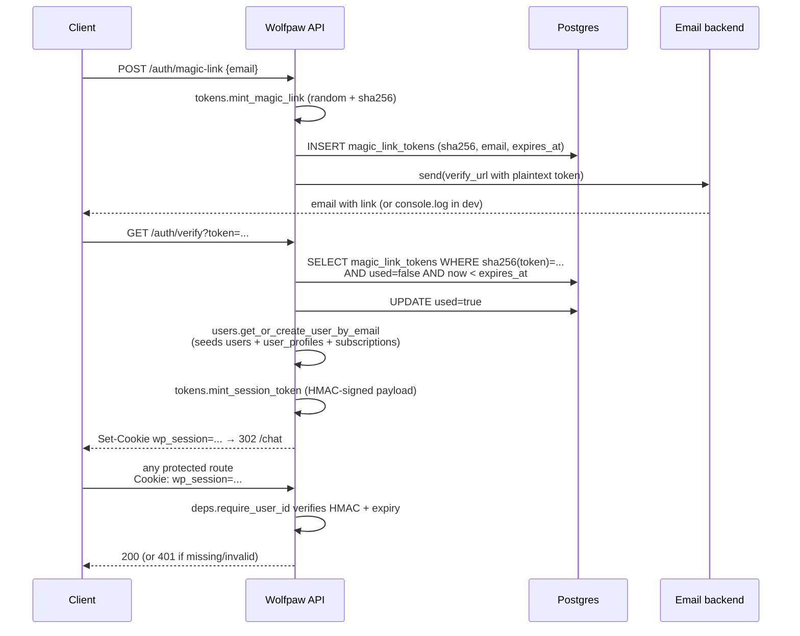

# auth/

Passwordless magic-link auth + cookie sessions for the FastAPI app. Routes hang off `/auth/*`; every authenticated request resolves to a `user_id` via `Depends(require_user_id)`. Top-level placement is in the [root README](../../../README.md).

## Files

- **`routes.py`** — the HTTP surface. `POST /auth/magic-link` (email a sign-in link), `GET /auth/verify?token=...` (consume the link, mint a session cookie, create the user on first sign-in), `GET /auth/me`, `POST /auth/logout`.
- **`tokens.py`** — token primitives. Magic-link tokens are random + SHA-256 hashed before storage (the DB never sees the plaintext). Session tokens are HMAC-signed payloads carrying `user_id` + expiry; they live in a signed `wp_session` cookie.
- **`users.py`** — `get_or_create_user_by_email`. On first sign-in, seeds a `users` row, a `user_profiles` row, and a `subscriptions` row at `tier = 'dev'` — all in one transaction so a new user always lands fully initialized.
- **`deps.py`** — FastAPI dependencies. `get_current_user_id(request)` returns the UUID from the session cookie or None; `require_user_id` raises 401 when missing. Use the latter on any protected route.
- **`email_backend.py`** — pluggable sender. `console` backend (default for dev) prints the link to logs; the SES backend can be added when email forwarding lands. Tests inject a capturing fake.

## Flow

## How it fits together

`request_magic_link` → write hashed token + email to `magic_link_tokens` → `email_backend.send` the verify URL. The user clicks it: `verify_magic_link` checks the token is fresh + unused, marks it used, upserts the user, mints a session token, sets the cookie. From that point on, `require_user_id` resolves every protected route. [`channels/web.py`](../channels/README.md) and the workspace + tasks + metering route packages all wire `require_user_id` into their dependency chains.

Slack + Telegram channels don't use this directly — they verify channel-side (HMAC for Slack, secret token for Telegram) and map their channel identity to a wolfpaw user_id through `channel_links` in [`memory/`](../memory/README.md).

## Extending

- **New auth method** (e.g. Google OAuth, GitHub) — add routes here, store the provider+subject in a sibling table, and reuse `mint_session_token` so the rest of the app treats the session identically.
- **Per-user API keys** — same idea: hash the key at issuance, validate via a new dependency, and add it to the `Depends` chain on programmatic endpoints.
- **Real email backend** — swap `console` for `ses` (or `smtp`) and set `WOLFPAW_EMAIL_BACKEND` in your `.env`. The existing token + verify path doesn't change.
