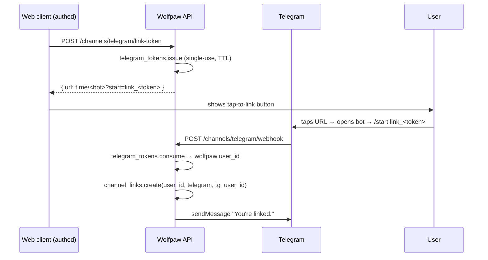
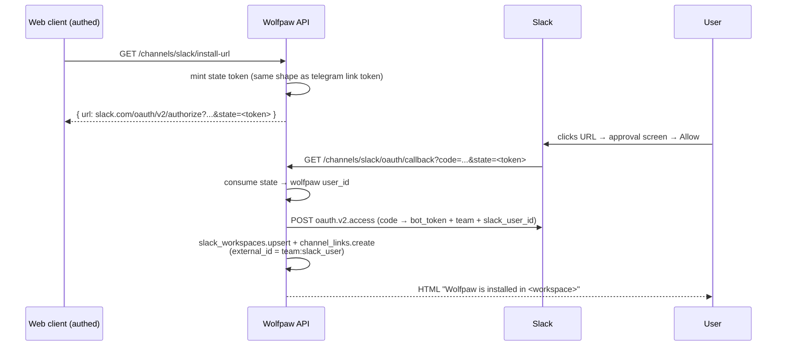

# channels/

User-facing surfaces — web, Telegram, Slack, eventually email. Every channel implements the same `Channel` interface and feeds normalized messages into a shared slash-command dispatcher before any agent sees them. The [root README](../../../README.md) shows where channels sit at the top-level.

## Files

- **`__init__.py`** — `Channel` ABC + `InboundMessage` dataclass. Every channel implements `receive(payload) → InboundMessage`, `send(user_id, content)`, `supports_streaming()`. The ABC is the contract; concrete channels live as siblings.
- **`commands.py`** — `CommandDispatcher` + `@register("name", "description")` decorator. Slash messages are intercepted here so they never burn model tokens; non-slash messages return `None` and fall through to the Router in [`agents/`](../agents/README.md). `CommandResult` carries an optional `clear_thread` flag — channels with client-side thread state honor it to drop the current thread id. `/help` and `/reset` are built-ins; other commands self-register from their owning module (e.g. `metering/usage_report.py` registers `/usage`, `tasks/commands.py` registers `/tasks` / `/task <id>` / `/cancel <id>`).
- **`web.py`** — `WebChannel` + `POST /channels/web/chat` SSE endpoint + `POST /channels/web/answer` (resolves `ask_user` pending questions). Chat dispatches through `commands` first; non-command messages flow to the Router. SSE events: `thread`, `reset`, `command`, `triage`, `pre_eval`, `plan`, `tool`, `task`, `ask_user`, `step.start` / `step.end` / `step.error`, `step.recover`, `plan.replan`, `score`, `skill_emitted`, `delta`, `done`, `error`.
- **`telegram.py`** — `TelegramChannel` + two routes. `POST /channels/telegram/webhook` validates `X-Telegram-Bot-Api-Secret-Token`, handles `/start link_<token>` onboarding inline, dispatches slash commands inline, and routes free-form messages via [`workers/queue.enqueue_telegram_dispatch`](../workers/README.md). `POST /channels/telegram/link-token` (authed) mints a single-use deep-link URL `https://t.me/<bot>?start=link_<token>`.
- **`telegram_client.py`** — `HttpTelegramClient` (httpx wrapper over `sendMessage`) + `FakeTelegramClient` for tests. `set_telegram_client(...)` is the test-injection hook.
- **`telegram_markdown.py`** — `to_markdown_v2(text)` converts the agent's CommonMark-ish output into Telegram MarkdownV2 with proper escaping.
- **`telegram_tokens.py`** — `issue` / `consume` for `channel_link_tokens` (URL-safe plaintext + SHA-256 hash, single-use). Reused by Slack — the OAuth `state` parameter is one of these tokens, bound to the wolfpaw user who clicked "Connect Slack".
- **`slack.py`** — `SlackChannel` + four routes: `GET /channels/slack/install-url` (mints state + returns OAuth URL), `GET /channels/slack/oauth/callback` (exchanges code + persists workspace), `POST /channels/slack/events` (URL-verification + DM dispatch via the worker queue), `POST /channels/slack/commands` (`/wolfpaw <text>`). HMAC signature on every inbound POST via `slack_signing.py`.
- **`slack_signing.py`** — `verify(...)` against `X-Slack-Signature` + ±5min replay window. Raises `BadSignature` on any failure.
- **`slack_client.py`** — `HttpSlackClient` (httpx wrapper over `oauth.v2.access` + `chat.postMessage`) + `FakeSlackClient` + injection hook.

## Flow

```mermaid
flowchart TD
    Provider[("web client / Telegram / Slack")]
    Provider -->|"HTTP POST"| Channel
    Channel["channels/<provider>.py<br/>parse payload → InboundMessage"]
    Channel --> Auth{authenticated?<br/>auth/ for web,<br/>HMAC for Slack,<br/>secret token for Telegram}
    Auth -->|"no"| Reject[401 / 403]
    Auth -->|"yes"| Dispatch["CommandDispatcher.dispatch"]
    Dispatch -->|"slash match"| Slash[CommandResult<br/>rendered back to user<br/>never reaches model]
    Dispatch -->|"None"| RouteChoice{push channel?}
    RouteChoice -->|"Telegram / Slack"| Enqueue["workers/queue.enqueue_*_dispatch<br/>(or asyncio.create_task in dev)"]
    RouteChoice -->|"Web SSE"| InlineRouter[Router.handle in-process<br/>(SSE stream tied to HTTP)]
    Enqueue --> Worker[arq worker]
    Worker --> Router[agents/ Router.handle]
    InlineRouter --> Router
    Router --> Send[channel.send<br/>or SSE delta]
    Send --> Provider

    click Channel "."
    click Dispatch "commands.py"
    click Auth "../auth/README.md"
    click Enqueue "../workers/README.md"
    click Router "../agents/README.md"
```

**Why web stays in-process while Telegram + Slack queue:** the web SSE stream is tied to the HTTP connection — routing the agent to arq would require a Redis pub-sub bridge back to the open response. Telegram + Slack don't have that constraint because the reply is pushed asynchronously via `sendMessage` / `chat.postMessage`. So push channels were the easy durability win.

## Telegram onboarding (deep link)



## Slack install (OAuth)



The Slack app itself is created by the operator from [`docs/slack-app-manifest.yaml`](../../../docs/slack-app-manifest.yaml) — one app per deployment (production / staging / dev). Each workspace install gets its own bot token in `slack_workspaces`.

## Extending

- **New channel** (email next): subclass `Channel`, parse the payload into `InboundMessage`, mount a webhook/route, run inbound through `dispatcher.dispatch` for slash commands and either `Router.handle` (synchronous) or `workers/queue.enqueue_*_dispatch` (push channels) for free-form messages.
- **New slash command** — `@register("name", "description")` on an `async (msg, args) -> CommandResult` handler in whatever module owns the data. Make sure the module gets imported at app boot so the side-effect registration runs (see `api.py`).
- **Slack: channel mentions + threads** (#35 in [`v2_implementation_plan.md`](../../../v2_implementation_plan.md)). v1 routes DMs only. `app_mention` events are already in scope at install time; wiring them means handling `event.type == "app_mention"` in `_handle_message_event` and mapping Slack `thread_ts` onto wolfpaw's `thread_id`.
- **Telegram file uploads + inline keyboards** (#36) — pull from `Document` / `PhotoSize` payloads and register them via [`workspace/`](../workspace/README.md). Inline keyboards make `ask_user` choices a tap instead of a typed reply.
