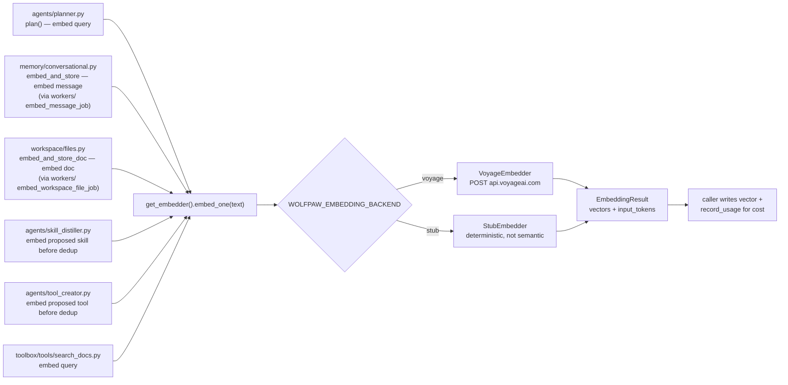

# embeddings/

Pluggable embedding subsystem. Two providers behind one interface so dev / tests can run without a Voyage API key while production embeds through Voyage's `voyage-3` model. Used by [`agents/planner.py`](../agents/README.md) (query embedding for retrieval), [`memory/conversational.py`](../memory/README.md) (per-message embedding for vector recall), [`workspace/files.py`](../workspace/README.md) (per-doc embedding for `search_docs`), and the auto-emitted skills + tool dedup paths. Top-level placement is in the [root README](../../../README.md).

## Files

- **`base.py`** — `EmbeddingClient` ABC + `EmbeddingResult` dataclass (`vectors`, `input_tokens`, `model`). Implementations expose `embed(texts) -> EmbeddingResult` and the convenience `embed_one(text)`.
- **`voyage.py`** — `VoyageEmbedder`: POSTs to `https://api.voyageai.com/v1/embeddings` via httpx. Reads the API key passed to its constructor; raises a clear error if missing rather than crashing in the middle of a planner call. Returns Voyage's reported `total_tokens` for cost recording.
- **`stub.py`** — `StubEmbedder`: deterministic SHA-256-derived L2-normalized vectors. Same input always embeds the same way; different inputs get different vectors. NOT semantically meaningful (similarity between two stub vectors is essentially random) — use it for wiring / round-trip tests, not for retrieval-quality experiments.
- **`__init__.py`** — `get_embedder()` factory honoring `WOLFPAW_EMBEDDING_BACKEND` (`voyage` | `stub`). Cached; `reset_embedder()` is the test/dev hook.

## Flow — who calls embed_one

## Cost recording

The embedder returns `input_tokens`; the caller routes that through [`metering.recorder.record_usage`](../metering/README.md) with `model=<embedder.name>` so embeddings show up in `/usage` as their own line. The seeded `model_prices` row prices `voyage-3` at $0.06/Mtok.

## Extending

- **New provider** (OpenAI / Cohere / local) — subclass `EmbeddingClient`, implement `embed(texts)`, add a branch in the `get_embedder()` factory keyed on a new `WOLFPAW_EMBEDDING_BACKEND` value. Keep the dimension the same (1024) so the DB IVFFlat indexes don't need to change; if you must change dimension, add a migration that drops + recreates the `vector(N)` columns and the IVFFlat indexes on `plans.query_embedding`, `skills.embedding`, `tools.embedding`, `message_embeddings.embedding`, `workspace_files.embedding`.
- **Cost recording at provider level** — today the caller does the `record_usage` write. If a new provider has cost data shaped differently (per-call instead of per-token), route through a small helper here rather than the per-caller pattern.
