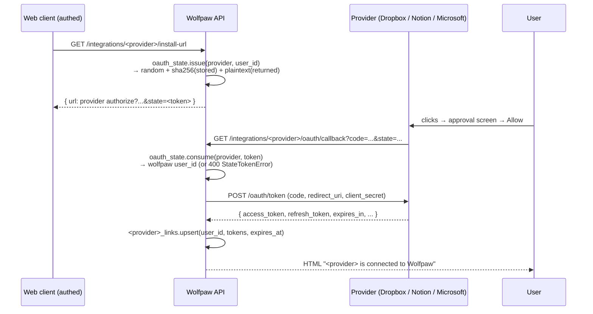
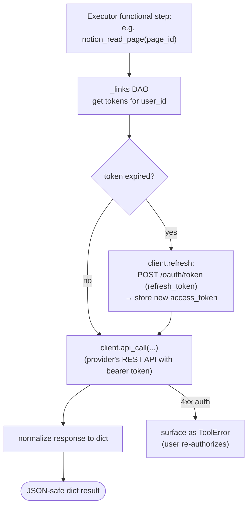

# integrations/

OAuth-gated third-party services the agent can read and write through with the user's explicit consent. Each provider lives in a self-contained subpackage that ships:

- a per-provider OAuth flow (install URL + callback),
- a thin HTTP client wrapping the provider's API,
- a small set of tools that register themselves on import into [`toolbox/`](../toolbox/README.md).

The Planner sees these tools only when the user has connected the provider (its tokens row exists), so it can't propose `notion_*` steps for a user who hasn't installed Notion. Operator setup is documented in [`docs/oauth-integrations.md`](../../../docs/oauth-integrations.md). Top-level placement is in the [root README](../../../README.md).

## Files

- **`oauth_state.py`** — shared state-token issuance for OAuth authorization-code flows. Mirrors [`channels/telegram_tokens.py`](../channels/README.md) in shape (single-use, TTL-bound, plaintext-in-URL / SHA-256-on-disk) but in its own `integration_state_tokens` table because integrations aren't channels. `issue(provider, user_id)` mints a fresh state; `consume(provider, token)` validates atomically and recovers the bound wolfpaw user_id. Provider mismatch (Notion-issued token consumed at the Dropbox callback) surfaces as `StateTokenError` so a misconfigured callback URL can't accidentally complete the wrong flow. Default TTL: 15 minutes.

### Provider subpackages

Each subpackage follows the same three-file layout — `client.py` for the HTTP wrapper (auto-refresh of tokens), `routes.py` for the OAuth install + callback + disconnect endpoints, `tools.py` for the agent-callable tools. The `__init__.py` does `from <provider> import tools  # noqa: F401` so import-side-effect registers the tools.

- **`dropbox/`** — App-folder scope (`/Apps/Wolfpaw/`). Three tools: `dropbox_list_folder`, `dropbox_read_file`, `dropbox_write_file`. Tokens in [`memory/dropbox_links`](../memory/README.md).
- **`notion/`** — Workspace pages. Three tools: `notion_search` (workspace-scoped search), `notion_read_page` (metadata + child blocks merged into one normalized payload — nested blocks are NOT recursively expanded; agent drills in by id), `notion_create_page` (title + optional `body_markdown` rendered as a paragraph block; richer block types deferred). Tokens in `memory/notion_links`.
- **`microsoft/`** — Outlook Calendar. Two tools: `outlook_calendar_list_events`, `outlook_calendar_create_event`. Tokens in `memory/microsoft_links`.

## Flow — OAuth install (any provider)

After this completes, the next plan that touches that provider will see its tools rendered in the Planner's catalog block (driven by `connected_integrations` from [`agents/planner.py`](../agents/README.md)).

## Flow — tool call (any provider)

Refresh is automatic per provider — the tool calls don't see expired tokens. If the provider revokes (user disconnected on their side, app uninstalled), the next call surfaces as `ToolError` and the user can reconnect via the web UI.

## How it fits together

- **[`memory/`](../memory/README.md)** holds the per-provider link tables (`dropbox_links`, `notion_links`, `microsoft_links`) and `integration_state_tokens`. Each link table is keyed on `user_id` + carries the encrypted-at-application-layer-if-needed bearer + refresh tokens.
- **[`toolbox/`](../toolbox/README.md)** — provider tools register themselves on import. They appear in the Planner's catalog block automatically because the global registry is the source of truth.
- **[`agents/planner.py`](../agents/README.md)** — `_resolve_connected_integrations(conn, user_id)` returns the list of provider names the user has connected; the Planner inlines this into its prompt so it knows which providers are available without re-checking per step.
- **[`auth/`](../auth/README.md)** — install routes require `require_user_id`; the state token binds the OAuth flow to the wolfpaw user who initiated it.

## Migrations

- `012_integrations.sql` — `integration_state_tokens` + `dropbox_links`
- `013_notion.sql` — `notion_links`
- `014_microsoft.sql` — `microsoft_links`

A new provider gets its own migration for the link table, even if the columns are identical. Keeps the per-provider history separable.

## Extending

- **New provider** (Google Calendar, Gmail readonly, GitHub, …):
  1. Create the link table in a new migration.
  2. Add the subpackage: `client.py` (token refresh + HTTP), `routes.py` (`/install-url`, `/oauth/callback`, `DELETE /integrations/<provider>`), `tools.py` (`@register_tool` per capability), `__init__.py` (`from <provider> import tools`).
  3. Add the link table DAO to [`memory/`](../memory/README.md).
  4. Mount the router in `api.py`.
  5. Add a connection-status check to `_resolve_connected_integrations` in [`agents/planner.py`](../agents/README.md).
  6. Document the operator setup in [`docs/oauth-integrations.md`](../../../docs/oauth-integrations.md).
- **Refresh failures** — today a hard 4xx during refresh surfaces as a `ToolError` and the user re-authorizes. A future improvement is a background nightly health check that flags expired refresh tokens and notifies the user proactively.
- **Token encryption at rest** — bearer tokens are stored verbatim in the link tables in v1. Operators with stricter threat models can encrypt the column at the application layer in a fork (the existing reads/writes are isolated in the DAO, so a wrapper is straightforward).
- **Gmail policy** — Gmail write/send/modify scopes are intentionally off the table; only read-only Gmail is on the roadmap.
