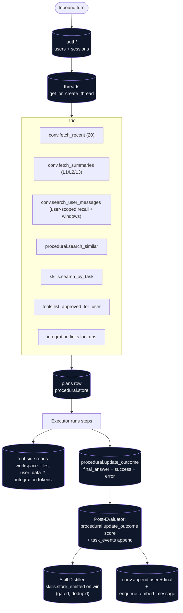

# memory/

Postgres access + the agent-facing memory subsystems. Every DAO in here is consumed by [`agents/`](../agents/README.md) (for reading context and writing outcomes) and by [`toolbox/`](../toolbox/README.md) (for read-only retrieval inside tools). Top-level placement is in the [root README](../../../README.md).

## Files

- **`db.py`** — process-wide asyncpg pool. `get_pool()` lazily creates it from `WOLFPAW_DATABASE_URL`; `acquire()` is the standard `async with acquire() as conn` context manager every DAO uses. Registers pgvector types and a JSONB codec (`json.dumps`/`json.loads`) on each connection so callers can pass dicts directly. Provides `migrations_dir()` + `apply_sql_file(conn, path)` for tests and dev bootstrap.
- **`conversational.py`** — `threads` + `messages` access + tiered summaries. **Threads are channel-agnostic:** a user has one continuous conversation that follows them across web / Telegram / Slack. `get_most_recent_thread(user_id)` resolves the user's single most-recent thread regardless of which channel last touched it, so a conversation started on web continues on Telegram and vice versa; `get_or_create_thread(...)` validates ownership before reuse and silently mints a fresh thread if the supplied id belongs to another user (don't leak existence). New threads are stamped with the active `soul_version` + the user's `user_profile.version` so plan/procedural-memory retrieval can later filter to "same persona snapshot". `append(...)` writes one row — stamping the originating channel into `messages.metadata.channel` for provenance — and enqueues embed via [`workers/queue.enqueue_embed_message`](../workers/README.md). `fetch_recent(thread_id, n=20)` returns the verbatim window. `fetch_summaries(thread_id)` returns the active tiered summaries oldest-range-first: the single **L3** digest plus every L2/L1 not yet folded into a higher level (`folded_into_summary_id IS NULL`). `search_relevant(thread_id, query_embedding, ...)` is per-thread **recency-weighted** vector recall over `message_embeddings` — it blends cosine distance with a recency bonus (newer beats equally-relevant-older) and returns each hit wrapped in ±`window` neighbor messages so recalled context reads as a coherent snippet, excluding the recent window so the Planner doesn't see duplicates of what `fetch_recent` already returned. `search_relevant` also takes an optional `max_distance` relevance floor (default off) so precision-sensitive callers don't dredge up loosely-related hits. `search_user_messages(user_id, ...)` is the **user-scoped** recall used everywhere memory should be treated as one thing — the Planner's automatic per-turn recall as well as the `recall_memory` tool. Same ranking/window logic as `search_relevant` but across *every* thread the user owns (windows and recency stay within each message's thread). `exclude_recent_thread_id` + `exclude_recent_n` drop just the current thread's verbatim window (so the Planner doesn't duplicate what `fetch_recent` loaded) without hiding any other thread. `search_relevant` (the older per-thread form) remains for any single-thread callers. `embed_and_store(...)` is what the worker job calls back into.
- **`procedural.py`** — the "recipe-box" over `plans`. `StoredPlan` dataclass. `search_similar(user_id, query_embedding, k=5, min_score=None)` does pgvector cosine lookup; rows without embeddings are skipped. `store(...)` inserts a generated plan. `update_outcome(...)` is partial-write — the Executor writes `final_answer` + `success` + `error`, the Post-Evaluator follows up with `score`.
- **`skills.py`** — generalized reusable procedures over `skills`. `Skill` dataclass; `search_by_task(user_id, query_embedding, k=5)` returns user-owned + seeded (`user_id IS NULL`) matches, filtering superseded rows. `STARTER_SKILLS` is the v1 hand-written exemplar set; `seed_starter_skills(...)` is idempotent. `store_emitted(...)` is what the Skill Distiller calls (caller dedups via cosine before invoking). `list_active_for_user` / `neighbours` / `mark_superseded` power the Sleep Cycle's consolidation pass.
- **`task_events.py`** — append-only DAO over `task_events`. `append_event(task_id, event_type, content)` writes one row; `fetch_for_task(task_id, limit)` reads chronologically. `task_id` is nullable so the Post-Evaluator can emit `plan_scored` events for plans that aren't wrapped in a Task.
- **`tasks.py`** — DAO for `tasks` with the full state machine: `create` (accepts `parent_task_id` + `budget_cents` for subagent tasks), `get_by_id` (user-scoped), `list_for_user`, terminal transitions, `attach_plan`, `get_depth` (walks `parent_task_id` for the executor's depth cap), `get_root` (walks to the top of the chain — per-root subagent concurrency semaphore relies on this), `rollup_spent_cents` (sums `token_usage.cost_cents + compute_usage.cost_cents` for the task and writes back to `tasks.spent_cents` on terminal transitions). Terminal status is sticky — subsequent transition attempts no-op rather than corrupting state. `cancel` and `get_by_id` are user-scoped so one user can't kill or inspect another's task.
- **`channel_links.py`** — DAO for `channel_links` (per-user mapping from wolfpaw user_id to a channel-side identity, e.g. Telegram user id, or Slack `<team_id>:<user_id>`). Unique on `(channel, external_id)` so the same Telegram account or `(workspace, slack user)` pair can't link to two wolfpaw users.
- **`slack_workspaces.py`** — DAO for `slack_workspaces` (per-Slack-workspace bot token + installer). `upsert` is idempotent and clears `revoked_at` so a re-install reactivates; `get(team_id)` is the webhook's hot path; `revoke` soft-deletes.
- **`tools.py`** — DAO for `tools` (Tool Creator outputs): `propose / approve / reject`, `find_active_by_name(user_id, name)` (the Executor's fall-through when a builtin doesn't match), `list_approved_for_user` (Planner inlines these into its catalog block), `search_similar` (cosine dedup before proposal).

## Flow — what hits Postgres on a single turn



Plus async work that fires after the response is sent: workers/jobs/compact_thread.py runs L1 → L2 → L3 compaction when a thread crosses the trigger threshold (see [`workers/README.md`](../workers/README.md)). L1 folds ~20 raw messages; L2 folds ~10 L1s; L3 folds ~10 L2s into a **single, rewritten-in-place** digest so the summary layer stays O(1) in the prompt no matter how long the conversation runs.

## Tuning conversational memory

The whole conversational-memory pipeline is config-driven — every knob below is a field on `Settings` ([`config.py`](../config.py)) and is overridable via a `WOLFPAW_`-prefixed env var (e.g. `WOLFPAW_VECTOR_RECALL_K=20`). No code change or migration needed; restart the app/worker to pick up new values. Defaults are tuned for a personal, long-running single thread.

**What lands in every prompt** = the recent verbatim window + the active tiered summaries + recency-weighted vector recall. The design goal is that this stays *flat-sized* no matter how long the conversation runs: the recent window is hard-capped, recall returns a fixed top-k, and the summary layer folds up into a single rewritten L3 digest rather than growing.

### Recent window + compaction ladder

| Env var | Default | Effect |
| --- | --- | --- |
| `WOLFPAW_RECENT_WINDOW_SIZE` | 20 | Verbatim recent messages always in the prompt. Bigger = more literal recent context, larger prompt. Also the count excluded from vector recall (no duplicates). |
| `WOLFPAW_COMPACTION_TRIGGER_THRESHOLD` | 40 | Message count at which L1 summarization starts (should be ≥ recent_window + compaction_window). |
| `WOLFPAW_COMPACTION_WINDOW_SIZE` | 20 | Raw messages folded into one L1 summary. |
| `WOLFPAW_L2_FOLD_THRESHOLD` | 10 | Un-folded L1s that trigger a fold into one L2. |
| `WOLFPAW_L3_FOLD_THRESHOLD` | 10 | Un-folded L2s that trigger a fold into the single L3 digest. |
| `WOLFPAW_L3_MAX_TOKENS` | 1200 | Model output budget when (re)writing the L3 digest — the effective size cap. |
| `WOLFPAW_L3_CHAR_CAP` | 6000 | Hard truncation backstop on the stored L3, in case the model overruns its token budget. The L3 lands in every prompt, so this bounds it unconditionally. |

The L3 is **rewritten in place** (at most one row per thread): each fold feeds the current digest + new L2s back to the summarizer, which keeps durable facts and lets older detail compress away. It's lossy about the distant past by design — that's what keeps the prompt O(1).

### Vector recall (`search_relevant`)

| Env var | Default | Effect |
| --- | --- | --- |
| `WOLFPAW_VECTOR_RECALL_K` | 15 | Number of semantic hits retrieved. Higher = broader recall but more prompt (and, with windows, more neighbors). |
| `WOLFPAW_VECTOR_RECALL_RECENCY_WEIGHT` | 0.15 | λ — the *max* recency bonus subtracted from cosine distance (for a brand-new message). Raise to favor recent context more aggressively; set `0` for pure cosine (age-blind). Keep it small so it only breaks near-ties and never overrides a strong semantic match. |
| `WOLFPAW_VECTOR_RECALL_HALF_LIFE_DAYS` | 30 | How fast the recency bonus decays: a message this old gets half the bonus of one sent now. Lower = sharper recency preference; `≤ 0` disables the bonus. |
| `WOLFPAW_VECTOR_RECALL_WINDOW` | 2 | Neighbor messages pulled on each side of every hit (by thread order) for conversational coherence. `0` = isolated hits. Note worst-case recall size ≈ `k × (2·window + 1)` when hits don't cluster. |

Scoring is `cosine_distance − recency_weight · 0.5^(age_days / half_life_days)`, lowest-first. If the recall block ever feels bloated on real conversations, lower `k` or `window`; if it feels too present-biased, lower `recency_weight` or raise `half_life_days`.

## How it fits together

Every module that touches Postgres imports `acquire` from `db.py`. The pool is closed on FastAPI shutdown via the lifespan hook in `api.py`. Tests that need a real DB drop and re-apply migrations into a scratch schema, then close the pool between cases (see the `_fresh_db` fixture pattern in `test_auth_flow.py` / `test_memory_conversational.py`). Tests that *don't* want a DB monkeypatch `wolfpaw.memory.db.acquire` to a no-op context manager and patch the bound names in importing modules.

## Importing-module gotcha

`acquire` is typically imported with `from wolfpaw.memory.db import acquire`. That binds the name into the importing module's namespace, so monkeypatching `wolfpaw.memory.db.acquire` in tests doesn't hit the bound name. Patch the importing module too:

```python
monkeypatch.setattr("wolfpaw.memory.db.acquire", _fake_acquire)
monkeypatch.setattr("wolfpaw.agents.quick.acquire", _fake_acquire)
monkeypatch.setattr("wolfpaw.metering.model_client.acquire", _fake_acquire)
```

Same applies to other DB helpers like `get_active_price` that some modules pull in by name.

## Extending

- **New seeded skill** — append a dict to `STARTER_SKILLS` in `skills.py` (`name` unique, `description` is what gets embedded, `ingredients` lists the tools it uses, `steps` is the skeleton). `seed_starter_skills` is name-keyed so it'll add the new one without re-inserting the existing seeds.
- **Vector recall scope** — recall is **user-scoped** (`search_user_messages` joins `threads` on `user_id`), spanning every thread the user owns — the direction of travel is away from "thread" as a meaningful boundary at all; it's just a container messages hang off. `message_embeddings` uses an **HNSW** index (`018_message_embeddings_hnsw.sql`) — high recall-at-latency into the millions of vectors, no clustering assumption, and no post-backfill `VACUUM ANALYZE` step (unlike the IVFFlat indexes still used by `plans` / `skills` / `tools` / `workspace_files`). Query-time recall/speed is governed by the `hnsw.ef_search` GUC (default 40) if you ever need to tune it.
- **New memory type** (#44 entity / knowledge base) — model the rows in a new migration, write a DAO sibling here, add a retrieval helper to [`agents/planner.py`](../agents/README.md)'s context build.
