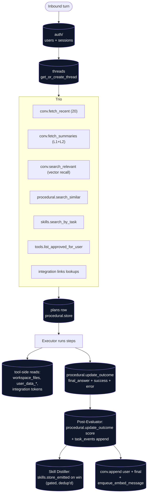

# memory/

Postgres access + the agent-facing memory subsystems. Every DAO in here is consumed by [`agents/`](../agents/README.md) (for reading context and writing outcomes) and by [`toolbox/`](../toolbox/README.md) (for read-only retrieval inside tools). Top-level placement is in the [root README](../../../README.md).

## Files

- **`db.py`** — process-wide asyncpg pool. `get_pool()` lazily creates it from `WOLFPAW_DATABASE_URL`; `acquire()` is the standard `async with acquire() as conn` context manager every DAO uses. Registers pgvector types and a JSONB codec (`json.dumps`/`json.loads`) on each connection so callers can pass dicts directly. Provides `migrations_dir()` + `apply_sql_file(conn, path)` for tests and dev bootstrap.
- **`conversational.py`** — `threads` + `messages` access + tiered summaries. `get_or_create_thread(...)` validates ownership before reuse and silently mints a fresh thread if the supplied id belongs to another user (don't leak existence). New threads are stamped with the active `soul_version` + the user's `user_profile.version` so plan/procedural-memory retrieval can later filter to "same persona snapshot". `append(...)` writes one row and enqueues embed via [`workers/queue.enqueue_embed_message`](../workers/README.md). `fetch_recent(thread_id, n=20)` returns the verbatim window. `fetch_summaries(thread_id)` returns every L2 summary plus the L1s not yet folded into one. `search_relevant(thread_id, query_embedding, k, exclude_recent_n)` is per-thread cosine search over `message_embeddings`, deliberately excluding the recent window so the Planner doesn't see duplicates of what `fetch_recent` already returned. `embed_and_store(...)` is what the worker job calls back into.
- **`procedural.py`** — the "recipe-box" over `plans`. `StoredPlan` dataclass. `search_similar(user_id, query_embedding, k=5, min_score=None)` does pgvector cosine lookup; rows without embeddings are skipped. `store(...)` inserts a generated plan. `update_outcome(...)` is partial-write — the Executor writes `final_answer` + `success` + `error`, the Post-Evaluator follows up with `score`.
- **`skills.py`** — generalized reusable procedures over `skills`. `Skill` dataclass; `search_by_task(user_id, query_embedding, k=5)` returns user-owned + seeded (`user_id IS NULL`) matches, filtering superseded rows. `STARTER_SKILLS` is the v1 hand-written exemplar set; `seed_starter_skills(...)` is idempotent. `store_emitted(...)` is what the Skill Distiller calls (caller dedups via cosine before invoking). `list_active_for_user` / `neighbours` / `mark_superseded` power the Sleep Cycle's consolidation pass.
- **`task_events.py`** — append-only DAO over `task_events`. `append_event(task_id, event_type, content)` writes one row; `fetch_for_task(task_id, limit)` reads chronologically. `task_id` is nullable so the Post-Evaluator can emit `plan_scored` events for plans that aren't wrapped in a Task.
- **`tasks.py`** — DAO for `tasks` with the full state machine: `create` (accepts `parent_task_id` + `budget_cents` for subagent tasks), `get_by_id` (user-scoped), `list_for_user`, terminal transitions, `attach_plan`, `get_depth` (walks `parent_task_id` for the executor's depth cap), `get_root` (walks to the top of the chain — per-root subagent concurrency semaphore relies on this), `rollup_spent_cents` (sums `token_usage.cost_cents + compute_usage.cost_cents` for the task and writes back to `tasks.spent_cents` on terminal transitions). Terminal status is sticky — subsequent transition attempts no-op rather than corrupting state. `cancel` and `get_by_id` are user-scoped so one user can't kill or inspect another's task.
- **`channel_links.py`** — DAO for `channel_links` (per-user mapping from wolfpaw user_id to a channel-side identity, e.g. Telegram user id, or Slack `<team_id>:<user_id>`). Unique on `(channel, external_id)` so the same Telegram account or `(workspace, slack user)` pair can't link to two wolfpaw users.
- **`slack_workspaces.py`** — DAO for `slack_workspaces` (per-Slack-workspace bot token + installer). `upsert` is idempotent and clears `revoked_at` so a re-install reactivates; `get(team_id)` is the webhook's hot path; `revoke` soft-deletes.
- **`tools.py`** — DAO for `tools` (Tool Creator outputs): `propose / approve / reject`, `find_active_by_name(user_id, name)` (the Executor's fall-through when a builtin doesn't match), `list_approved_for_user` (Planner inlines these into its catalog block), `search_similar` (cosine dedup before proposal).

## Flow — what hits Postgres on a single turn



Plus async work that fires after the response is sent: workers/jobs/compact_thread.py runs L1/L2 summarization when a thread crosses the trigger threshold (see [`workers/README.md`](../workers/README.md)).

## How it fits together

Every module that touches Postgres imports `acquire` from `db.py`. The pool is closed on FastAPI shutdown via the lifespan hook in `api.py`. Tests that need a real DB drop and re-apply migrations into a scratch schema, then close the pool between cases (see the `_fresh_db` fixture pattern in `test_auth_flow.py` / `test_memory_conversational.py`). Tests that *don't* want a DB monkeypatch `wolfpaw.memory.db.acquire` to a no-op context manager and patch the bound names in importing modules.

## Importing-module gotcha

`acquire` is typically imported with `from wolfpaw.memory.db import acquire`. That binds the name into the importing module's namespace, so monkeypatching `wolfpaw.memory.db.acquire` in tests doesn't hit the bound name. Patch the importing module too:

```python
monkeypatch.setattr("wolfpaw.memory.db.acquire", _fake_acquire)
monkeypatch.setattr("wolfpaw.agents.quick.acquire", _fake_acquire)
monkeypatch.setattr("wolfpaw.metering.model_client.acquire", _fake_acquire)
```

Same applies to other DB helpers like `get_active_price` that some modules pull in by name.

## Extending

- **New seeded skill** — append a dict to `STARTER_SKILLS` in `skills.py` (`name` unique, `description` is what gets embedded, `ingredients` lists the tools it uses, `steps` is the skeleton). `seed_starter_skills` is name-keyed so it'll add the new one without re-inserting the existing seeds.
- **Cross-thread vector recall** — `search_relevant` is per-thread by design (`WHERE thread_id = $1`). Lifting that into a user-toggle is a follow-on once the per-thread path has real usage. Touch `message_embeddings` lookups carefully — the IVFFlat index needs a `VACUUM ANALYZE` after large backfills to stay useful.
- **New memory type** (#44 entity / knowledge base) — model the rows in a new migration, write a DAO sibling here, add a retrieval helper to [`agents/planner.py`](../agents/README.md)'s context build.
