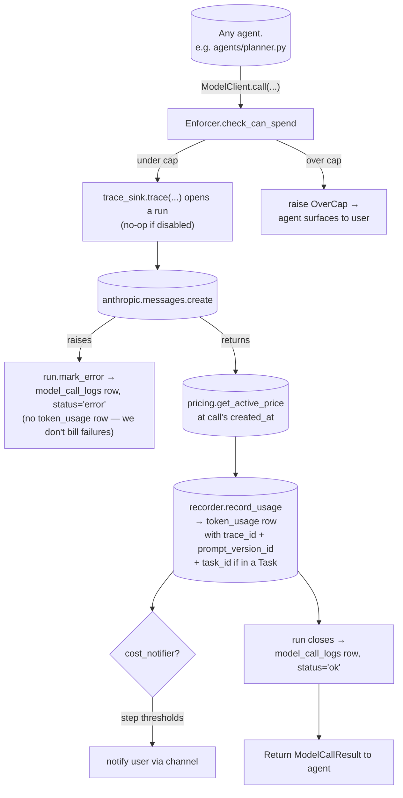

# metering/

Per-call cost recording for every model call, the trace log behind the monitoring view, the cap enforcer, the prompt-version registry, and the `/usage` slash command. Built before any agent so from the first model call we have full observability. Top-level placement is in the [root README](../../../README.md).

## Two tables, two clocks

Observability here is split deliberately across two tables, because the two halves age differently:

| | `token_usage` | `model_call_logs` |
|---|---|---|
| **One row per** | successful model call | model call *attempt*, success or failure |
| **Holds** | tokens, cost, agent, model | payloads, latency, stop reason, error |
| **Size** | tiny, fixed-width | fat and unbounded |
| **Retention** | long — it's billing data | `WOLFPAW_TRACE_RETENTION_DAYS` (default 14) |
| **Storage** | flat table | monthly RANGE partitions |

The split is what lets a long cost history exist without dragging gigabytes of prompt text along with it. It's also why failures are visible at all: `record_usage` runs *after* a successful response, so a call that raises never reaches it — the trace row is the only evidence the attempt happened.

## Reading it back

`/monitor` is the read side, structured as the three questions you ask in order when something is wrong:

| Question | Endpoint | Shows |
|---|---|---|
| Is it broken right now? | `GET /monitor/summary?window=` | Error rate, p50/p95 latency, spend, same broken out per agent, top failure signatures |
| Which requests were bad? | `GET /monitor/traces?window=&errors=` | One row per `trace_id` — an inbound prompt and everything it caused |
| What happened inside this one? | `GET /monitor/traces/{trace_id}` | Every call in order, with prompts, responses, attempts and errors |

A **trace** is the unit worth reasoning about: one inbound prompt, and every model call it fanned out into (triage → planner → executor → sub-agents). `run_id` / `parent_run_id` preserve the nesting, so a sub-agent's calls belong to the executor call that spawned them rather than floating in a flat list.

## Files

- **`types.py`** — shared dataclasses: `TokenCounts`, `ModelPrice`, `ModelCallResult`, `PromptVersionRow`.
- **`pricing.py`** — `compute_cost_cents(price, usage)` (pure, rounds up so we never undercharge) and `get_active_price(conn, model_id, at_time)` (respects `effective_from / effective_to` so historical rows price as they were at the call's `created_at`).
- **`prompt_versions.py`** — read/write the `prompt_versions` table. `get_active_prompt_version(agent)` returns the row to stamp on each `token_usage` write; `bump_prompt_version(...)` is the idempotent loader called when an agent's prompt changes.
- **`recorder.py`** — `record_usage(...)` inserts one `token_usage` row per model call, with `trace_id` pulled from the request-scoped contextvar so callers don't have to plumb it.
- **`enforcer.py`** — `Enforcer.check_can_spend(user_id)`. No-op stub in the OSS app (every user is on the `dev` tier); operators wire in a real period-summary lookup that raises `OverCap` when the user is at allowance with overage off.
- **`trace_sink.py`** — `PostgresTraceSink` wraps each model call in a *run* and writes one `model_call_logs` row per attempt: system prompt, messages, response blocks, stop reason, latency, and the exception when there was one. `NullTraceSink` is the no-op used when `WOLFPAW_TRACE_SINK_ENABLED=false` and by unit tests. The sink is an injected interface, so an additional destination (a vendor forwarder, a file) can be added without touching any agent.
- **`model_client.py`** — `ModelClient.call(...)` is the central wrapper every agent goes through. The Anthropic client is injectable so tests pass a fake.
- **`usage_report.py`** — backs the `/usage` slash command. `build_usage_report(user_id, scope)` queries `token_usage × model_prices` via a LATERAL join (priced per-row at its own `created_at`), plus `compute_usage`, returns a `UsageReport` dataclass, and caches per `(user_id, scope)` for 30s.
- **`routes.py`** — JSON `GET /usage?scope=default|today|month|all` consumed by the React app.
- **`monitor.py`** — read-side queries over `model_call_logs`: `build_summary` (error rate, latency percentiles, spend, per-agent and top-failure breakdowns), `list_traces` (one row per inbound prompt), `get_trace` (every call in one trace, with payloads), `recent_errors` (the failure feed). All user-scoped in SQL.
- **`monitor_routes.py`** — `GET /monitor/{summary,traces,traces/{id},errors}`, backing the Monitoring tab in the React app.

## Flow — single model call

The pricing and recording steps run *inside* the run context, so a failure at any of them — not just an Anthropic error — closes the run as `status='error'`.

`/usage` reads back from `token_usage × model_prices` (LATERAL join so historical calls are priced as they were at `created_at`) plus `compute_usage` for sandbox-seconds. Caching is per-scope, 30 seconds.

## How it fits together

Every model call: agent → `ModelClient.call(user_id, agent, model, messages, prompt_version_id=...)`. The wrapper enforces caps, opens a trace run, hits Anthropic, computes cost from the active price row, writes a `token_usage` row, closes the run into `model_call_logs`, returns the result. Same path for embeddings — see [`embeddings/`](../embeddings/README.md) — except those use `record_usage` directly with `model=<embedder.name>` (no trace run because embeddings aren't model conversations).

Sandbox compute metering lives in [`sandbox/metering.py`](../sandbox/README.md) and writes to `compute_usage` on sandbox teardown — separate table from `token_usage`, same scoping by `task_id`. `/usage` sums both.

## Extending

- **New agent's prompt** — before its first call, ensure a `prompt_versions` row exists (call `bump_prompt_version` once at boot for each agent). Pass the resulting `id` as `prompt_version_id` to `ModelClient.call`.
- **New model** — add a row to `model_prices` (use a follow-up migration). Pricing + recording adapt automatically because `get_active_price` looks up by `model_id` + `created_at`.
- **Real enforcement** — swap `Enforcer.check_can_spend` for a real implementation that reads `usage_summaries` for the current period; existing tests cover the no-op path.
- **New cost dimension** (e.g. paid OAuth API calls billed through to the user) — add a sibling table (`<provider>_usage`), record from the relevant tool in [`toolbox/`](../toolbox/README.md) or [`integrations/`](../integrations/README.md), and surface in `usage_report.build_usage_report`.
- **A second trace destination** — implement the `TraceSink` protocol (a `trace(**kwargs)` async context manager yielding a `ModelRun`) and pass it as `ModelClient(traces=...)`. No agent changes; the run carries everything a forwarder needs.
- **Retention policy** — `WOLFPAW_TRACE_RETENTION_DAYS` is enforced at partition granularity by `workers/jobs/prune_traces.py`. Finer cutoffs mean a shorter partition interval (weekly/daily) in `ensure_model_call_log_partition`, not a switch to `DELETE` — the whole point of partitioning here is that expiry reclaims disk instantly.
