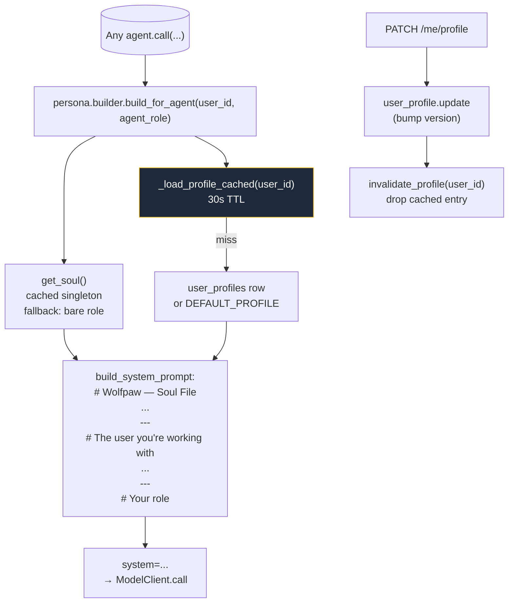

# persona/

Wolfpaw's two persona inputs:
- **Soul** — the agent's identity, shared across all users. Lives in `soul.md` at the repo root.
- **User File** — per-user persona + structured preferences. One row per user in `user_profiles`.

Every agent's system prompt is built from these two inputs at call time. Top-level placement is in the [root README](../../../README.md).

Soul + Profile both have a version number; new threads stamp those versions onto `threads.soul_version` + `user_profile_version` so plans + procedural memory can later be scoped to "same persona snapshot" if needed.

## Files

- **`soul.py`** — loads `soul.md` from disk and hashes it (12-char SHA-256 prefix = `version`). `get_soul()` is the cached singleton; `reset_soul()` + `set_soul_for_test(content)` are dev/test hooks. Path resolution: `settings.soul_path` if set, else `<repo_root>/soul.md` via `default_soul_path()`.
- **`user_profile.py`** — `UserProfile` dataclass + DAO. `get(conn, user_id)` returns the row or None; `update(conn, user_id, **fields)` is partial-write and bumps `version` on every change so downstream stamping stays meaningful. `DEFAULT_PROFILE` is the fallback used when a user has no row yet.
- **`builder.py`** — pure `build_system_prompt(soul, user_profile, agent_role)` (no I/O — useful for tests) and the runtime helper `build_for_agent(user_id, agent_role)` that loads Soul + Profile and assembles. Defensive: if either lookup fails (file missing, DB down, etc.) the agent gets the bare role prompt so the call still goes through in degraded mode. Profile lookups are cached per-user with a 30-second TTL; `invalidate_profile(user_id)` drops the entry synchronously (PATCH wires this in), and the TTL self-heals other workers within `_PROFILE_TTL_SECONDS`.
- **`routes.py`** — `GET /me/profile` + `PATCH /me/profile` (partial body — any subset of `persona_md` / `preferences` / `timezone`). PATCH bumps version and calls `invalidate_profile(user_id)` so the next agent call sees the updated row immediately.

## Flow — assembling a system prompt

Thread creation (`memory.conversational.get_or_create_thread`): looks up the current Soul version + the user's profile version and stamps both into the `threads` row. Both columns are nullable so a missing Soul file or missing profile row degrades to NULL rather than blocking.

`prompt_versions` rows hash only the **agent role** (stable) — the dynamic Soul + Profile blocks vary per-user and aren't part of the version hash. The `token_usage.prompt_version_id` thus reflects intentional agent-code changes, not user-specific personalization.

## Failure posture

- Soul file missing / unreadable → agents log a warning once, get a prompt without the Soul block, continue.
- User has no profile row (legacy users, manual deletion) → builder uses `DEFAULT_PROFILE`; GET endpoint returns a defaulted shape rather than 404 so the client can PATCH.
- DB unavailable mid-call → profile fetch raises, builder falls back to default, agent's call still proceeds.

## Extending

- **Soul history** — today only the current Soul is loadable. A future "what soul was active on date X" would need either git-tracked versions on disk or a `soul_history` table.
- **Procedural-memory scoping by persona** — `plans` could grow `soul_version` + `user_profile_version` columns so retrieval can filter to plans that ran under the same persona snapshot. The thread-stamped versions already exist; this just adds plan-side stamping in the Planner.
- **Wolfpaw-edits-the-profile flow** — future tool `update_user_profile` (with `ask_user` confirmation) so the agent can append things it learns about the user (with consent).
