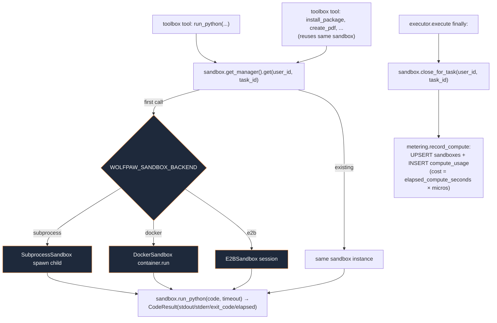

# sandbox/

Sandboxed Python execution behind a uniform interface. Three providers (subprocess for dev, Docker for self-host, E2B for hosted) all implement the same `Sandbox` ABC; the manager hands one back keyed on `(user_id, task_id)` so state persists across tool calls. Used by [`toolbox/`](../toolbox/README.md)'s `run_python` / `install_package` / `sandbox_*` / artifact tools, lifecycle-managed by [`agents/executor.py`](../agents/README.md). Top-level placement is in the [root README](../../../README.md).

## Files

- **`base.py`** — `Sandbox` ABC + `CodeResult` / `InstallResult` dataclasses + `SandboxError` / `SandboxFatalError`. Required methods: `run_python`, `install_package`, `read_file`, `write_file`, `close`, plus the `elapsed_compute_seconds` property that compute metering reads at teardown.
- **`subprocess.py`** — `SubprocessSandbox`: dev/test default. Long-lived Python REPL in a child process talking JSON-line IPC. State persists across `run_python` calls. POSIX rlimit caps CPU + memory; per-call timeout kills the child and the next call respawns. Not a real security boundary — documented as such.
- **`_repl_server.py`** — the small script the SubprocessSandbox child runs. Reads JSON commands from stdin, runs `exec` against a persistent globals dict, writes JSON results back.
- **`docker.py`** — `DockerSandbox`: per-task locked-down container (`network_disabled=True`, mem/CPU caps, tmpfs `/sandbox`). `docker` package loaded lazily behind the `[docker]` extra. Self-host production.
- **`e2b.py`** — `E2BSandbox`: hosted production via the `e2b-code-interpreter` SDK. Loaded lazily behind the `[e2b]` extra.
- **`manager.py`** — `SandboxManager` keyed on `(user_id, task_id|None)`. `get(...)` builds-or-returns; `close_for_task(...)` tears one down (and records compute); `shutdown_all()` is the test-cleanup hook. Factory branches on `WOLFPAW_SANDBOX_BACKEND`.
- **`metering.py`** — `record_compute(...)` writes the `sandboxes` row (upsert, accumulating compute_seconds) and a `compute_usage` row. Cost = `compute_seconds × sandbox_compute_per_second_micros`, rounded up. Called by the manager at teardown. `compute_cost_cents(...)` is the pure pricing helper.
- **`__init__.py`** — public exports (`Sandbox`, `SandboxManager`, `get_manager`, `reset_manager`, errors); providers stay lazily-imported through the manager.

## Flow — sandbox lifecycle inside one Task

The sandbox is implicitly created on the first call that needs it; the executor's `finally` always closes it, which is also when compute is metered. Closing a sandbox that was never spun up is a safe no-op (the manager pops by key).

## Extending

- **New provider** — subclass `Sandbox`, implement the seven required methods + `elapsed_compute_seconds`, add a branch in `manager._build`. Tests pattern: pass a mocked client into the constructor (see `test_sandbox_docker_mocked.py` / `test_sandbox_e2b_mocked.py`).
- **Per-task egress allowlist** — DockerSandbox currently runs with `network_disabled=True`, so `install_package` is unsupported there. When the executor accepts a per-task URL allowlist from the planner, this is where to thread it through to the container's `network_mode`.
- **Tighter limits** — edit `subprocess.py`'s `_set_limits` for the dev path; `docker.py`'s container `mem_limit` / `pids_limit` / `tmpfs` for Docker; E2B's are template-side.
