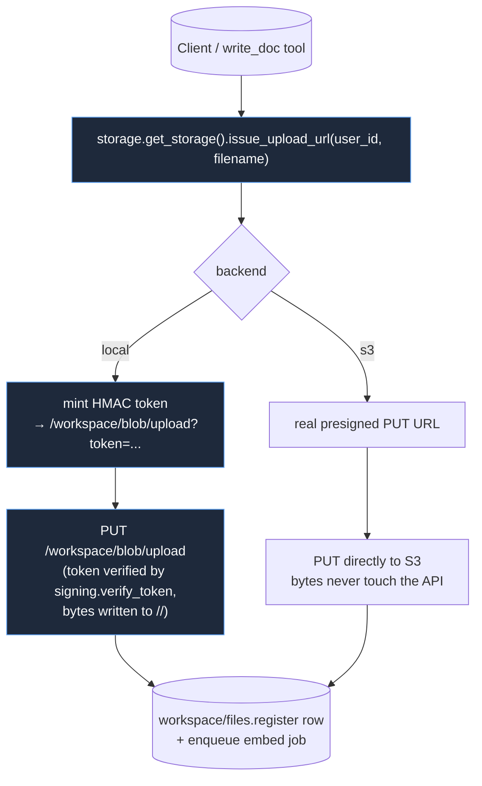

# storage/

Per-user workspace storage behind a uniform interface so the workspace API and `read_doc` / `write_doc` tools don't care whether bytes live on local disk, in S3, or eventually in Drive / Dropbox. The catalog rows that live alongside these bytes belong to [`workspace/`](../workspace/README.md); this package only owns the bytes. Top-level placement is in the [root README](../../../README.md).

## Files

- **`base.py`** — `Storage` ABC + `SignedURL` and `StorageObject` dataclasses. Required methods: `put`, `get`, `delete`, `exists`, `issue_upload_url`, `issue_download_url`. Path validation is per-adapter; agents always see logical filenames, never raw URLs.
- **`local.py`** — `LocalStorage`: bytes on disk under `<root>/<user_id_hex>/<filename>`. Default for dev + self-host. Pre-signed URLs are HMAC-signed tokens pointing back at the same process's `/workspace/blob/{upload,download}` endpoints (`supports_local_blob_endpoints() == True`). Filename validation rejects path separators, `..`, NUL, etc.
- **`s3.py`** — `S3Storage`: bytes in S3 under `s3://<bucket>/<user_id_hex>/<filename>`. boto3 is loaded lazily so this module imports cleanly without the `[s3]` extra. Returns real AWS presigned URLs, so bytes never transit the API host.
- **`signing.py`** — HMAC-signed token format used by LocalStorage. `mint_token(payload, secret)` / `verify_token(token, secret)`. Payload includes user_id, filename, op, max_bytes, expiry. Tampered or expired tokens raise `TokenError`.
- **`__init__.py`** — `get_storage()` factory that returns the backend selected by `WOLFPAW_STORAGE_BACKEND` (`local` | `s3`). Cached; `reset_storage()` is the test/dev hook.

## Flow — upload (local vs S3)

Download is the mirror: `GET /workspace/files/{id}/download-url` mints a token (local) or a presigned URL (S3), client GETs.

## How it fits together

`workspace/routes.py` calls `get_storage()` to mint URLs and read/write bytes. Tools (`read_doc`, `write_doc`, artifact tools) do the same. The signing tokens are HMAC'd with `settings.secret_key`; the same secret validates them on the blob endpoints. S3 doesn't need those endpoints — its URLs go straight to AWS.

## Extending

- **New backend** (Drive, Dropbox, MinIO) — subclass `Storage`, implement the six methods, add a branch in the factory. Adapters that issue real third-party presigned URLs return `supports_local_blob_endpoints() == False`; the blob endpoints just become unused. (Note: Dropbox lives in [`integrations/`](../integrations/README.md) today as a separate user-data source — *not* a workspace storage backend. The boundary is "is this the user's general workspace, or a connected third-party scope?")
- **New filename rule** — edit `_validate_filename` in `local.py` (S3 reuses it). Tests in `test_storage_local.py::test_path_traversal_rejected` cover the boundary.
