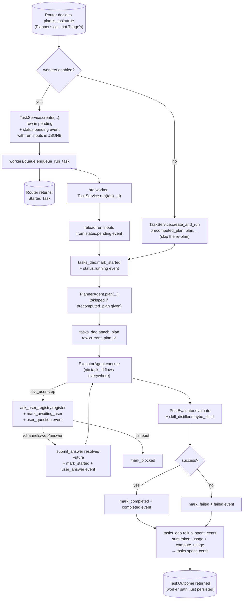

# tasks/

Persistent, trackable units of long-running work. A Task wraps the same Planner → Pre-Eval → Executor → Post-Eval pipeline from [`agents/`](../agents/README.md) in a row that has a state machine, can pause on `ask_user`, and survives process restart (when [`workers/`](../workers/README.md) is enabled). Top-level placement is in the [root README](../../../README.md).

## Files

- **`__init__.py`** — intentionally empty. Eager re-exports from `service` would create an import cycle (agents → toolbox → `ask_user` tool → tasks init → service → agents). Consumers use full module paths.
- **`service.py`** — `TaskService` exposes three entry points: (1) `create(...)` inserts the row in `pending` + stamps a `status.pending` event carrying the run inputs (content, thread_id, complexity_hint) so a worker process can recover them later; (2) `run(task_id)` reloads those inputs and drives the Planner → Pre-Eval → Executor → Post-Eval chain through to a terminal status; (3) `create_and_run(...)` does both inline — used by subagent steps (parent waits for child) and by the workers-off dev path. `TaskOutcome` dataclass carries the final task, plan, execution, verdict, and answer. Singleton `get_task_service()`.
- **`ask_user_registry.py`** — `AskUserRegistry`: process-local dict of `PendingQuestion`s keyed on `question_id`. `register(...)` creates an asyncio.Future the `ask_user` tool awaits; `submit_answer(...)` resolves it. Cross-user `submit_answer` attempts surface as `UnknownQuestion` rather than leaking the question's existence. `cancel(...)` raises in the awaiter — used when a task is cancelled mid-question.
- **`commands.py`** — registers `/tasks`, `/task <id>`, `/cancel <id>` with the channel dispatcher at module import. All three are user-scoped: you can't list, inspect, or cancel another user's tasks.
- **`routes.py`** — JSON HTTP API consumed by the React app: `GET /tasks`, `GET /tasks/{id}` (with events), `POST /tasks/{id}/cancel`. Same user-scoping as the slash commands. 404 on cross-user reads, 409 on cancel of an already-terminal task.

## Flow — task lifecycle

`spent_cents` rollup runs on every terminal transition (including planner-failed / executor-crashed via `_fail`, plus the `/cancel` route + slash command) so `/tasks` and `/task <id>` show authoritative final cost. The roll-up sums *direct* spend only — a subagent's own `spent_cents` reflects its own model + compute rows; a recursive CTE would surface full subtree cost once budget enforcement needs it.

## Subagents

Subagent steps in the Executor call `TaskService.create_and_run` without a precomputed plan (they plan fresh inside their own task). Same internal pipeline; `parent_task_id` is set so depth + per-root concurrency caps apply. See [`agents/README.md`](../agents/README.md) for the depth + concurrency rules.

## ask_user pause / resume — in-process caveats

1. Executor invokes `ask_user` with a question.
2. Tool calls `AskUserRegistry.register(...)` — gets back a `PendingQuestion` with an `answer_future`.
3. Tool transitions: `tasks_dao.mark_awaiting_user` + `task_events.append_event("user_question", ...)`.
4. Tool awaits the future with a timeout (default 5 min).
5. **Reply path:** user POSTs to `/channels/web/answer` with `{question_id, answer}`. The endpoint calls `registry.submit_answer(...)` which resolves the future.
6. Tool wakes: transitions back to `running`, writes `user_answer` event, returns `{question_id, answer}` to the executor.
7. **Timeout path:** `mark_blocked` + `ToolError`. The task is left in `blocked` for inspection.

If the runtime restarts while a question is pending, the future is lost — the task is effectively orphaned. Acceptable for sync execution within one request. Workers-mode `ask_user` is a known gap: the registry lives in-process on whichever process holds the running task, but `/answer` lands on the API process. Today they only resolve cleanly when both happen on the same process. Fixing this needs a Postgres LISTEN/NOTIFY (or Redis pub-sub) signal from `/answer` to the worker.

## How it fits with the rest

- **[`memory/tasks.py`](../memory/README.md)** owns the row + state transitions.
- **[`memory/task_events.py`](../memory/README.md)** is the append-only history every transition writes to.
- **[`agents/router.py`](../agents/README.md)** calls `TaskService.create(...)` or `create_and_run(...)` based on `WOLFPAW_WORKERS_ENABLED` + `plan.is_task`.
- **[`channels/web.py`](../channels/README.md)** owns the `/answer` endpoint that resolves pending questions.
- **[`workers/`](../workers/README.md)** runs the `run_task` job when workers are on.
- **[`metering/`](../metering/README.md)** — every model call inside a task records `task_id` in `token_usage`; sandbox compute likewise flows through `compute_usage`. `rollup_spent_cents` sums both.

## Extending

- **Proactive task-completion push** (#37 in [`v2_implementation_plan.md`](../../../v2_implementation_plan.md)) — when `TaskService.run` reaches a terminal state, look up `tasks.channel_for_completion` and call the appropriate channel's `Channel.send(user_id, content)` with the final answer. Today the worker quietly finishes the row; users have to poll `/tasks`.
- **`ask_user` across workers** — plumb `/answer` → worker via LISTEN/NOTIFY or Redis pub-sub so workers-mode tasks can pause for user input cleanly.
- **Recurring tasks** — `tasks.schedule_pattern` is already a column; an arq cron-style scheduler in [`workers/jobs/`](../workers/README.md) enqueues `run_task` on the cadence.
- **Recursive subtree cost** — `spent_cents` currently reflects direct spend only. A recursive CTE over `parent_task_id` would surface the full subtree cost on the root once budget enforcement needs it.
