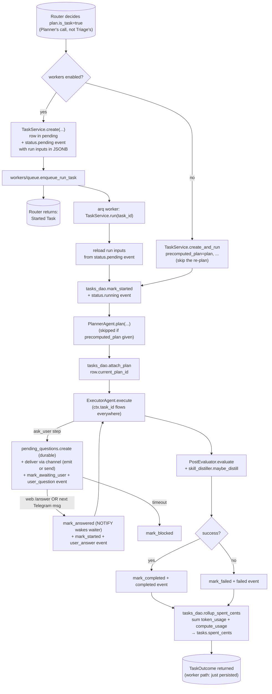

# tasks/

Persistent, trackable units of long-running work. A Task wraps the same Planner → Pre-Eval → Executor → Post-Eval pipeline from [`agents/`](../agents/README.md) in a row that has a state machine, can pause on `ask_user`, and survives process restart (when [`workers/`](../workers/README.md) is enabled). Top-level placement is in the [root README](../../../README.md).

## Files

- **`__init__.py`** — intentionally empty. Eager re-exports from `service` would create an import cycle (agents → toolbox → `ask_user` tool → tasks init → service → agents). Consumers use full module paths.
- **`service.py`** — `TaskService` exposes three entry points: (1) `create(...)` inserts the row in `pending` + stamps a `status.pending` event carrying the run inputs (content, thread_id, complexity_hint) so a worker process can recover them later; (2) `run(task_id)` reloads those inputs and drives the Planner → Pre-Eval → Executor → Post-Eval chain through to a terminal status; (3) `create_and_run(...)` does both inline — used by subagent steps (parent waits for child) and by the workers-off dev path. `TaskOutcome` dataclass carries the final task, plan, execution, verdict, and answer. Singleton `get_task_service()`.
- **`ask_user` durable store** — lives in [`memory/pending_questions.py`](../memory/README.md), not here. A `pending_questions` row is the source of truth for a paused question; `ask_user` writes it, delivers the question to the user's channel, then `wait_for_answer(...)` blocks on a Postgres LISTEN/NOTIFY signal (with a periodic backstop re-read). `mark_answered(...)` is user-scoped and compare-and-set on `status='pending'`, so it works across processes (API `/answer` vs. arq worker) and tells a first answer apart from a double-submit.
- **`commands.py`** — registers `/tasks`, `/task <id>`, `/cancel <id>` with the channel dispatcher at module import. All three are user-scoped: you can't list, inspect, or cancel another user's tasks.
- **`routes.py`** — JSON HTTP API consumed by the React app: `GET /tasks`, `GET /tasks/{id}` (with events), `POST /tasks/{id}/cancel`. Same user-scoping as the slash commands. 404 on cross-user reads, 409 on cancel of an already-terminal task.

## Flow — task lifecycle

`spent_cents` rollup runs on every terminal transition (including planner-failed / executor-crashed via `_fail`, plus the `/cancel` route + slash command) so `/tasks` and `/task <id>` show authoritative final cost. The roll-up sums *direct* spend only — a subagent's own `spent_cents` reflects its own model + compute rows; a recursive CTE would surface full subtree cost once budget enforcement needs it.

## Subagents

Subagent steps in the Executor call `TaskService.create_and_run` without a precomputed plan (they plan fresh inside their own task). Same internal pipeline; `parent_task_id` is set so depth + per-root concurrency caps apply. See [`agents/README.md`](../agents/README.md) for the depth + concurrency rules.

## ask_user pause / resume — durable + channel-agnostic

1. Executor invokes `ask_user` with a question.
2. Tool calls `pending_questions.create(...)` — a durable row is the source of truth (not an in-memory future). Same transaction: `tasks_dao.mark_awaiting_user` + `task_events.append_event("user_question", ...)`.
3. **Delivery:** if a live stream exists (`ctx.emit`, web SSE), emit an `ask_user` event so the client shows a reply box; otherwise push proactively through the originating channel's `send()` (Telegram/Slack). Resolved via the channel registry (`channels.get_channel`).
4. Tool calls `pending_questions.wait_for_answer(...)` — blocks on a Postgres LISTEN/NOTIFY on a dedicated connection (default 5 min), with a 15s backstop re-read so a missed signal can't hang it.
5. **Reply path:** web POSTs `/channels/web/answer`, OR the user's next Telegram message is matched to their open question (`get_open_for_user`). Either way it calls `mark_answered(...)`, which fires the NOTIFY that wakes the waiter — even if the waiter is in a different process (arq worker) than the reply endpoint (API).
6. Tool wakes: transitions back to `running`, writes `user_answer` event, returns `{question_id, answer}` to the executor.
7. **Timeout path:** `mark_timeout` + `mark_blocked` + `ToolError`. The task is left in `blocked` for inspection.

Because the round-trip meets at the DB row (not a live stream + shared memory), workers-on and workers-off behave the same, and web + Telegram are just different front doors. A parked task holds its execution slot (and one pooled connection) while waiting — fine at current scale; a full suspend/re-enqueue is only needed if that becomes a bottleneck. If the runtime restarts mid-wait the in-flight `wait_for_answer` is lost, but the row persists as `pending` for a future resume mechanism.

## How it fits with the rest

- **[`memory/tasks.py`](../memory/README.md)** owns the row + state transitions.
- **[`memory/task_events.py`](../memory/README.md)** is the append-only history every transition writes to.
- **[`agents/router.py`](../agents/README.md)** calls `TaskService.create(...)` or `create_and_run(...)` based on `WOLFPAW_WORKERS_ENABLED` + `plan.is_task`.
- **[`channels/web.py`](../channels/README.md)** owns the `/answer` endpoint that resolves pending questions.
- **[`workers/`](../workers/README.md)** runs the `run_task` job when workers are on.
- **[`metering/`](../metering/README.md)** — every model call inside a task records `task_id` in `token_usage`; sandbox compute likewise flows through `compute_usage`. `rollup_spent_cents` sums both.

## Extending

- **Proactive task-completion push** (#37 in [`v2_implementation_plan.md`](../../../v2_implementation_plan.md)) — when `TaskService.run` reaches a terminal state, look up `tasks.channel_for_completion` and call the appropriate channel's `Channel.send(user_id, content)` with the final answer. Today the worker quietly finishes the row; users have to poll `/tasks`. (The `ask_user` path already delivers via `channel.send()` — the same pattern applies to completion.)
- **Recurring tasks** — `tasks.schedule_pattern` is already a column; an arq cron-style scheduler in [`workers/jobs/`](../workers/README.md) enqueues `run_task` on the cadence.
- **Recursive subtree cost** — `spent_cents` currently reflects direct spend only. A recursive CTE over `parent_task_id` would surface the full subtree cost on the root once budget enforcement needs it.
