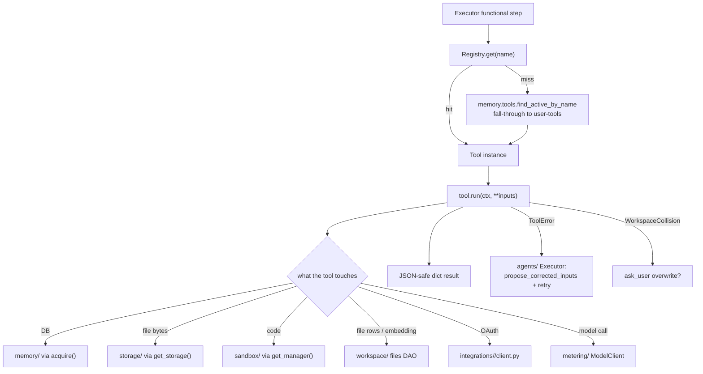

# toolbox/

Agent-callable tools and the registry that holds them. Importing the package registers every tool with the global registry as a side effect. Top-level placement is in the [root README](../../../README.md).

## Files

- **`registry.py`** — `Tool` ABC, `Registry`, `@register_tool` decorator, `ToolContext` (carries `user_id`, `task_id`, `trace_id` into every call), and two error types: `ToolError` (recoverable — the Executor's self-healing repair loop sees this) and `ToolFatalError` (unrecoverable). `Tool.to_anthropic_schema()` emits the shape Anthropic's `messages.create(tools=...)` expects. `catalog_block()` renders a Markdown listing of every tool's signature + description — the Planner inlines this into its system prompt so it can never propose unknown tools or miss required inputs.
- **`user_data.py`** — per-user `user_data_<uuid_hex>` schema management for the SQL tools. `ensure_schema(conn, user_id)` creates the schema on demand; `validate_identifier` + `quote_ident` are the safe-naming primitives for any DDL the tools build. `describe_columns(conn, schema, table)` + `list_user_tables(conn, user_id)` are the introspection helpers behind `describe_table` / `list_tables`. `explain_column_error(conn, schema, table, pg_error)` is the self-documenting error helper — when a write tool hits `asyncpg.UndefinedColumnError`, it appends the table's *actual* column list to the message so the agent's retry has something to work with.
- **`__init__.py`** — imports every tool module to trigger side-effect registration. Order doesn't matter; the registry deduplicates by name.

## Tools (in `tools/`)

### Information

- **`calculator`** — AST-whitelisted arithmetic eval. No names, no calls, no attribute access. Returns one number.
- **`http_get`** — `httpx` GET → readability extraction for HTML, verbatim for non-HTML. Size-capped.
- **`web_search`** — POST to Tavily, returns ranked results. Reads `WOLFPAW_TAVILY_API_KEY` at call time so missing key surfaces as an actionable `ToolError`.

### SQL — user data tables

The user's private SQL workspace lives in the `user_data_<uuid_hex>` Postgres schema. Identifiers are validated; values are passed as `$N` parameters (never interpolated); the JSONB codec is registered globally so dicts pass straight through to `jsonb` columns.

- **`create_table`** — DDL. Column types from a tight whitelist (`text`, `integer`, `bigint`, `numeric`, `double`, `boolean`, `date`, `timestamptz`, `jsonb`). Idempotent on table name: if the table already exists, returns `existed: true` + the **actual** column list from `information_schema` (not the requested one). Closes the failure mode where a stale prior table silently no-opped the DDL and the next step couldn't find its expected columns.
- **`sql_query`** — read-only SELECT. Two layers of defense: SELECT-only prefix check + `READ ONLY` transaction scoped to the user's schema.
- **`sql_insert`** — INSERT one or many rows (max 500 per call). All rows must share the same column set; column names validated as identifiers.
- **`sql_update`** — UPDATE with a structured `where` (column → value, AND'd together). An empty `where` is rejected unless `where_all: true` is set explicitly — accidental full-table updates take a deliberate flag.
- **`sql_delete`** — same shape as `sql_update`. Same `where_all` guard.
- **`list_tables`** — enumerate every table in the user's schema with each table's columns. No args. Pure read from `information_schema`.
- **`describe_table`** — one table's columns. Raises `ToolError` pointing at `list_tables` if the table doesn't exist.

The three write tools above catch `asyncpg.UndefinedColumnError` / `UndefinedTableError` and re-raise as `ToolError` containing the table's real column list. That's the hint the Executor's [self-healing repair loop](../agents/README.md) feeds back into the model on retry.

### Documents

- **`write_doc`** — write text to a workspace file. Collision → `WorkspaceCollision` unless `overwrite=True` (then version-bump). After register, enqueues an embed job via [`workers/queue.enqueue_embed_workspace_file`](../workers/README.md) so the doc shows up in `search_docs`.
- **`read_doc`** — fetch the latest version of a workspace file by filename via [`storage/`](../storage/README.md) + the `workspace_files` DAO. On miss, the error message lists up to 10 actual filenames and points the agent at `list_docs` / `search_docs`.
- **`list_docs`** — enumerate the user's workspace docs (latest version per filename) with size + version + mime + created_at. No args. Cheap — no Storage round-trip.
- **`search_docs`** — semantic search by *content*. Embeds the query, runs ANN search against `workspace_files.embedding`, returns ranked filenames + similarity scores. The agent then `read_doc`s the hits it wants.

### Sandbox

- **`run_python`** — execute Python in the task's sandbox; state persists across calls.
- **`install_package`** — `pip install` into the sandbox.
- **`sandbox_read_file`** / **`sandbox_write_file`** — UTF-8 text I/O against paths inside the sandbox.

### Artifact production (all run inside the sandbox)

- **`create_spreadsheet`** / **`create_chart`** / **`create_slides`** / **`create_pdf`** — outputs land in `workspace_files` with `source='agent_output'`. Shared scaffolding in `tools/_artifact.py`.

### Human-in-the-loop

- **`ask_user`** — pause the current Task, push a question to the user via their channel, return their answer once they reply. Requires `ctx.task_id`. Times out cleanly into `blocked` status. Persistence + reply plumbing live in [`tasks/`](../tasks/README.md) — this tool is the executor-side surface.

### OAuth integrations

Each provider in [`integrations/`](../integrations/README.md) registers its own tools on import. They appear in the catalog only when the user has connected the provider, so the Planner won't propose them otherwise.

- **Dropbox** — `dropbox_list_folder`, `dropbox_read_file`, `dropbox_write_file`. App-folder scoped (`/Apps/Wolfpaw/`).
- **Notion** — `notion_search`, `notion_read_page`, `notion_create_page`.
- **Microsoft (Outlook Calendar)** — `outlook_calendar_list_events`, `outlook_calendar_create_event`.

## Flow — what a tool call looks like

## How it fits together

The Quick Agent and the Executor look up tools via `get_registry().get(name)` and invoke `await tool.run(ctx, **inputs)`. The sandbox tools flow through `wolfpaw.sandbox.get_manager()` so one sandbox per `(user_id, task_id)` is reused across calls. Workspace tools talk to `wolfpaw.storage.get_storage()` and the `workspace_files` DAO; SQL tools talk to Postgres via `memory.db.acquire`.

## Extending

- **New tool** — subclass `Tool`, set `name` / `description` / `input_schema` (JSON Schema), implement `async def run(self, ctx, **inputs) -> dict`, decorate with `@register_tool`, and add the module import to `tools/__init__.py`. Raise `ToolError` for recoverable issues so the [Executor's repair loop](../agents/README.md) gets a chance to fix the inputs.
- **Self-documenting error message** — when a tool wraps a third-party API or DB query, catch the low-level error and re-raise as `ToolError` containing the *actual* state the agent needs to recover (the column list, the available filenames, the valid options). The repair model sees the error verbatim — if it's helpful, the retry succeeds; if it's opaque, the retry guesses.
- **New tool dimension** (e.g. a domain-specific recoverable exception): add a new exception type alongside `ToolError`; the executor catches and routes (the `WorkspaceCollision` → `ask_user` flow is the existing template).
