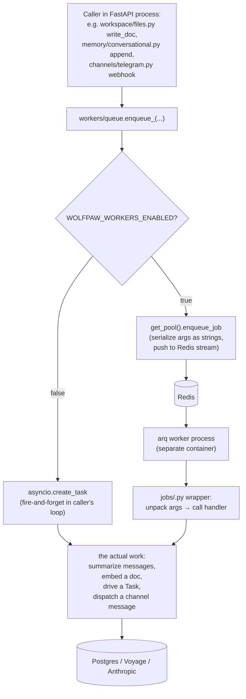

# workers/

Redis-backed async job runner via [arq](https://arq-docs.helpmanual.io/). When `WOLFPAW_WORKERS_ENABLED=true`, the FastAPI process enqueues jobs onto Redis and a separate `worker` container (or process) picks them up and runs them against the same Postgres / Anthropic / Voyage stack. With workers disabled (dev default), every enqueue falls back to `asyncio.create_task` in the caller's loop — so dev needs no Redis. Top-level placement is in the [root README](../../../README.md).

## Files

- **`queue.py`** — per-job typed enqueue helpers. Each branches on `WOLFPAW_WORKERS_ENABLED`: ON → `get_pool().enqueue_job("<name>", ...)` against arq; OFF → `_spawn_inline(...)` in the caller's loop. Module-global pool with a `close_pool` hook wired into FastAPI's lifespan in `api.py`. Exposes:
  - `enqueue_compact_thread(thread_id)`
  - `enqueue_embed_message(thread_id, message_id, content)`
  - `enqueue_embed_workspace_file(file_id, text)`
  - `enqueue_run_task(task_id)`
  - `enqueue_telegram_dispatch(...)`, `enqueue_slack_dispatch(...)`
- **`arq_app.py`** — `WorkerSettings` registering every job. Lifecycle hooks warm + drain the asyncpg pool on worker start/stop. The Sleep Cycle is registered as both a function (manual enqueue for ad-hoc runs) AND a cron job firing Sunday 03:00 UTC; the cron is safe to keep registered everywhere because the job itself no-ops unless `WOLFPAW_SLEEP_CYCLE_ENABLED=true`.

### `jobs/`

Thin arq-shaped wrappers that unpack stringified UUIDs back into typed args and delegate to the existing handlers in the relevant subpackage.

- **`compact_thread.py`** — `compact_thread_job(thread_id)` calls the tiered summarizer in [`memory/conversational.py`](../memory/README.md). L1: when a thread crosses `compaction_trigger_threshold` (default 40 messages), batch the oldest 20 messages older than the recent window into a Haiku summary → `thread_summaries(level=1)`. L2: when 10 un-folded L1s accumulate, fold the oldest 10 into one L2 row and stamp `folded_into_summary_id` on each child. L3: when `l3_fold_threshold` (default 10) un-folded L2s accumulate, fold them — plus the thread's current L3 — into a **single** L3 digest that is rewritten in place (never accumulated), bounded by `l3_max_tokens` / `l3_char_cap`, so the summary layer stays O(1) in the prompt. Also hosts `embed_message_job` and `embed_workspace_file_job` because they share a module file.
- **`run_task.py`** — `run_task_job(task_id)` drives [`tasks/service.py`](../tasks/README.md)'s `TaskService.run(task_id)` end-to-end: Planner → Pre-Eval → Executor → Post-Eval → terminal transition + spent-cents rollup.
- **`channel_dispatch.py`** — `telegram_dispatch_job` and `slack_dispatch_job`. Free-form inbound messages from Telegram + Slack route here so the webhook can return 200 fast and the actual agent work happens off the response path.
- **`sleep_cycle.py`** — weekly memory maintenance: re-score old plans, consolidate near-duplicate Skills (`mark_superseded` against the survivor), GC orphan threads. Gated on `WOLFPAW_SLEEP_CYCLE_ENABLED`.

## Flow — enqueue + run

## How it fits together

- **[`memory/conversational.py`](../memory/README.md)** — `conv.append` enqueues the embed + compaction trigger so the chat response path is never blocked by a Voyage hiccup or a Haiku summarization call.
- **[`workspace/files.py`](../workspace/README.md)** — `write_doc` (via the tool) enqueues the doc embed after the row + bytes have committed so `search_docs` can find it.
- **[`tasks/service.py`](../tasks/README.md)** — `TaskService.create()` + `enqueue_run_task` is what the Router calls when `WOLFPAW_WORKERS_ENABLED` is on (workers off → `create_and_run` inline).
- **[`channels/telegram.py`](../channels/README.md)** + **`slack.py`** — both route free-form inbound through the queue so the webhook returns 200 fast. The reply is pushed back via `sendMessage` / `chat.postMessage` after the agent finishes.
- **Sleep Cycle** — calls into [`memory/skills.py`](../memory/README.md)'s `mark_superseded` + `procedural` re-scoring helpers. Runs Sunday 03:00 UTC by default.

## Web SSE stays in-process

Web chat SSE is intentionally NOT moved onto the worker. The event stream is tied to the HTTP connection — routing the agent to arq would require a Redis pub-sub bridge back to the open response. Telegram + Slack don't have that constraint because their reply is pushed asynchronously, so they were the easy durability win.

## What needs Redis

| `WOLFPAW_WORKERS_ENABLED` | Redis required? | Behavior |
|---|---|---|
| `false` (dev default) | No | Every enqueue → `asyncio.create_task` inline. Crashes lose fire-and-forget work. |
| `true` (prod) | Yes — `WOLFPAW_REDIS_URL` | Jobs live on Redis. Survive process restart. Worker container needs to be up. |

`docker-compose.yml` ships both `redis` (with appendonly persistence) and `worker` services so the OSS self-host comes up workers-on out of the box.

## Extending

- **New job** — add the handler module under `jobs/`, write the thin `<name>_job` arq wrapper alongside (unpack string args, call the handler), add it to `WorkerSettings.functions` in `arq_app.py`, add a typed enqueue helper to `queue.py` (with the inline-fallback branch for dev), and call the helper from wherever the work was previously synchronous.
- **New cron** — add a `CronJob(...)` entry to `WorkerSettings.cron_jobs` in `arq_app.py`. Gate the actual work behind a config flag (the Sleep Cycle does this) so the cron is safe to register everywhere.
- **`ask_user` across workers** — known gap (see [`tasks/README.md`](../tasks/README.md)). Fixing this needs a Postgres LISTEN/NOTIFY signal from `/answer` to the worker process holding the registry.
- **Proactive task push** (#37) — when `run_task_job` finishes, look up `tasks.channel_for_completion` and call the channel's `Channel.send` with the final answer.
