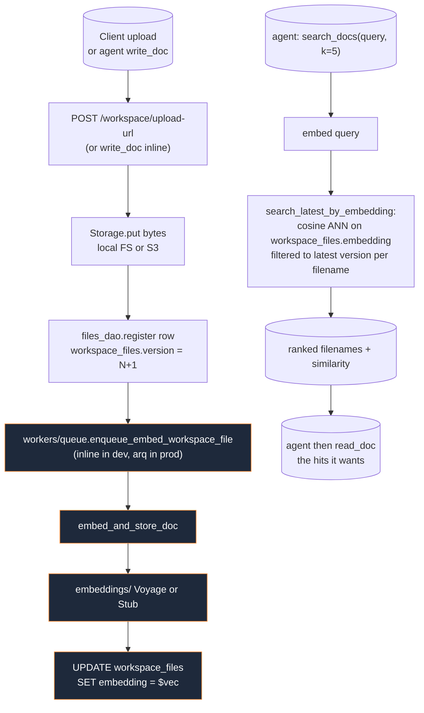

# workspace/

Per-user file registry — what the user uploads and what the agent produces, all in one listing. Backed by `workspace_files` rows + the `Storage` adapter from [`storage/`](../storage/README.md). Each row now also carries an `embedding vector(1024)` populated asynchronously after every write so docs are findable by content via `search_docs` (see [`toolbox/`](../toolbox/README.md)). Top-level placement is in the [root README](../../../README.md).

## Files

- **`files.py`** — `workspace_files` DAO. `list_latest(user_id)` (DISTINCT ON filename, latest version per row), `get_by_id`, `get_latest_by_filename`, `register(...)`. Append-only: overwrites insert a new row with `version = prior + 1` and `supersedes_id = prior.id` so the history chain stays. Also defines `WorkspaceCollision` — raised by `write_doc` so the Executor can route to `awaiting_user`. New since migration `015`: `update_embedding(file_id, vector)`, `search_latest_by_embedding(user_id, query_embedding, k)` (CTE joins to latest version per filename so superseded drafts don't surface as separate hits), and `embed_and_store_doc(file_id, text)` — what the [`workers/`](../workers/README.md) embed job calls back into.
- **`routes.py`** — HTTP API. `GET /workspace/files` (latest version per filename, per the user), `POST /workspace/upload-url` (mint a short-lived URL), `POST /workspace/files` (register a completed upload), `GET /workspace/files/{id}/download-url`. Plus the LocalStorage-only blob transit endpoints `PUT /workspace/blob/upload?token=...` and `GET /workspace/blob/download?token=...`.

## Flow — write + index + search

The embed happens after the row + bytes have committed. With workers off (dev), it runs inline as a fire-and-forget `asyncio.create_task` so the chat response is never blocked. With workers on (prod), `enqueue_embed_workspace_file` pushes the job to arq and a separate process handles it — surviving restarts.

## Upload + download flow

`POST /workspace/upload-url` mints a `SignedURL` from `storage.get_storage().issue_upload_url(user_id, filename)` → client PUTs bytes to that URL → client `POST /workspace/files` registers a row. On LocalStorage the URL points back at `/workspace/blob/upload`; on S3 it's a real AWS URL and bytes never touch the API. Download is the mirror: `GET .../download-url` → client GETs.

Agent writes (via `write_doc`) follow the same registration shape but with `source = 'agent_output'` and `task_id` set; collisions raise `WorkspaceCollision`.

## Extending

- **Folders / nested namespace** — v1 is intentionally flat. The S3 keys are already hierarchical (`<user_id_hex>/<filename>`) so adding folders is a frontend + DAO listing change, not a data migration.
- **New file source** (e.g. email attachment intake) — use `register(...)` with the appropriate `source` enum value; the listing endpoint surfaces it the same way and the embed job picks it up automatically.
- **Quotas / retention** — wire into `register` (check `sum(size_bytes)` against `tier_limits` before insert). The schema is ready.
- **Chunked embeddings for long docs** — today one embedding per file/version, computed over full text. Long markdown notes hit Voyage's input cap. The fix is content chunking with a sibling `workspace_file_chunks` table — each chunk indexed separately, `search_docs` returns the best chunk's parent file.
